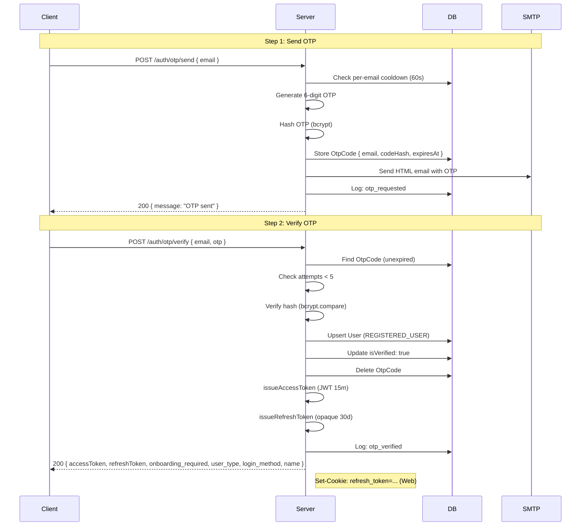
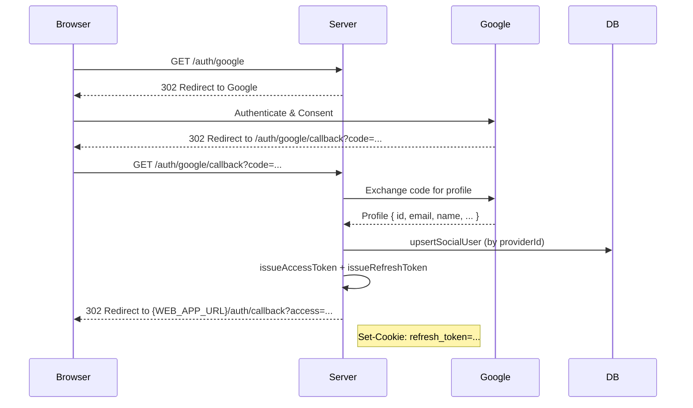
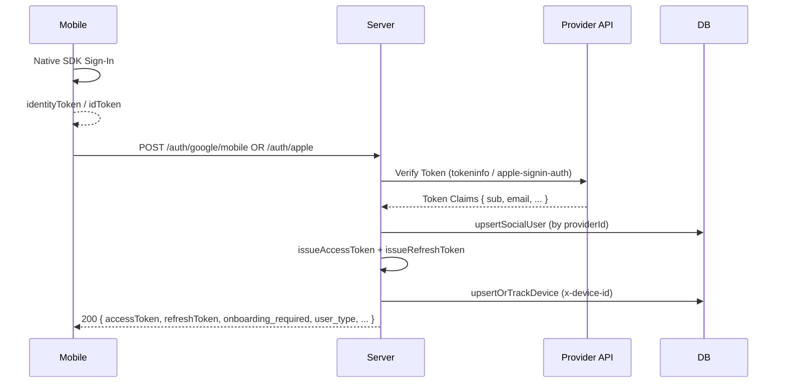

# Auth Module — Implementation Reference

> **Status:** ✅ Complete & tested  
> **Backend:** NestJS + Prisma + PostgreSQL

---

## Table of Contents

1. [Goals & Design Philosophy](#1-goals--design-philosophy)
2. [Architecture Overview](#2-architecture-overview)
3. [Prisma Schema Changes](#3-prisma-schema-changes)
4. [NPM Packages Added](#4-npm-packages-added)
5. [Token Strategy](#5-token-strategy)
6. [Auth Flows](#6-auth-flows)
   - [Email OTP](#61-email-otp-flow)
   - [Google Web (Redirect)](#62-google-web-redirect-flow)
   - [Google Mobile (idToken)](#63-google-mobile-flow)
   - [Apple Mobile (identityToken)](#64-apple-mobile-flow)
   - [Apple Web (Redirect)](#65-apple-web-redirect-flow)
7. [Account Linking Policy](#7-account-linking-policy)
8. [Profile & Onboarding Flow](#8-profile--onboarding-flow)
9. [Device Tracking](#9-device-tracking)
10. [Refresh Token Rotation](#10-refresh-token-rotation)
11. [Logout](#11-logout)
12. [JWT Guard & Guest Mode](#12-jwt-guard--guest-mode)
13. [Rate Limiting](#13-rate-limiting)
14. [Cookie vs Body Token Delivery](#14-cookie-vs-body-token-delivery)
15. [Environment Variables](#15-environment-variables)
16. [File-by-File Reference](#16-file-by-file-reference)
17. [API Endpoint Reference](#17-api-endpoint-reference)
18. [Security Decisions](#18-security-decisions)

---

## 1. Goals & Design Philosophy

### Single Upsert Endpoint Per Provider
There are **no separate sign-up and sign-in endpoints**. Every auth endpoint is an upsert:
- First call → creates the user and account
- Subsequent calls → finds the user and returns new tokens

This eliminates the "account already exists" / "account not found" error class entirely.

### Identity by Provider Sub, Not Email
Social accounts are identified by the provider's stable `sub` (subject) ID — never by email. Email addresses can change, can be reused, and can be faked. The `Account` table maps `(provider, providerId)` → `userId`.

### Short-lived Access + Long-lived Refresh
- **Access token:** 15 minutes, signed JWT, stateless
- **Refresh token:** 30 days, random bytes, hashed in the database

This means a stolen access token expires quickly, and compromised refresh tokens can be individually revoked from the database.

---

## 2. Architecture Overview

```
Client
  │
  ├── Web browser   → httpOnly cookie for refresh token
  └── Mobile app    → request body for refresh token, Keychain/Keystore for storage

NestJS API
  ├── AuthController        /auth/*
  ├── AuthService           core logic (upsert, OTP, token issuance)
  ├── JwtStrategy           validates Bearer tokens → req.user
  ├── GoogleStrategy        Passport OAuth2 web flow
  ├── JwtAuthGuard          global guard — skips @Public() routes
  └── GoogleAuthGuard       wraps Passport google strategy

Database (PostgreSQL via Prisma)
  ├── User          canonical identity
  ├── Account       one row per social provider link
  ├── RefreshToken  one row per active session (hashed)
  └── OtpCode       one row per sent OTP (hashed)
```

---

## 3. Prisma Schema Changes

### `prisma/schema/user.prisma` — Updated
```prisma
enum UserRole {
  GUEST
  REGISTERED_USER
  VERIFIED_USER
  CONTENT_ADMIN     
  CONTENT_APPROVER  // Reviews content (editorial + clinical approval)
  KB_UPLOADER
  KB_APPROVER
  CHAT_REVIEWER
  SUPER_ADMIN
}

enum MenopauseStage {
  PERIMENOPAUSE
  MENOPAUSE
  POSTMENOPAUSE
  UNKNOWN
}

enum OnboardingStatus {
  NOT_COMPLETED
  COMPLETED
}

enum AccountStatus {
  ACTIVE
  BLOCKED
  SUSPENDED
}

model User {
  id      String  @id @default(ulid())
  email   String? @unique
  name    String?
  pwdhash String?

  // Profile fields set during / after onboarding
  dateOfBirth    DateTime?
  menopauseStage MenopauseStage @default(UNKNOWN)
  timezone       String?        // IANA identifier, e.g. "Asia/Colombo"

  isVerified       Boolean          @default(false)
  role             UserRole         @default(GUEST)
  onboardingStatus OnboardingStatus @default(NOT_COMPLETED)
  accountStatus    AccountStatus    @default(ACTIVE)

  accounts      Account[]
  refreshTokens RefreshToken[]
  devices       Device[]
  authLogs      AuthLog[]

  createdAt DateTime @default(now())
  updatedAt DateTime @updatedAt
}
```

Key changes from original:
- `id` uses **ULID** for better performance and sortability.
- `email` made **nullable** (`String?`) — required for Apple users.
- **RBAC**: `role` field with `UserRole` enum.
- **Onboarding status**: Uses `OnboardingStatus` enum (`NOT_COMPLETED`, `COMPLETED`).
- **Account status**: Uses `AccountStatus` enum (`ACTIVE`, `BLOCKED`, `SUSPENDED`).
- **Profile fields**: Added `dateOfBirth`, `menopauseStage`, and `timezone`.

---

### `prisma/schema/account.prisma`
```prisma
model Account {
  id         String  @id @default(ulid())
  provider   String // "google" | "apple"
  providerId String // Google sub OR Apple sub
  email      String? // snapshot from provider — informational only
  userId     String
  user       User    @relation(fields: [userId], references: [id], onDelete: Cascade)

  createdAt DateTime @default(now())

  @@unique([provider, providerId])
}
```

---

### `prisma/schema/refreshToken.prisma`
```prisma
model RefreshToken {
  id        String    @id @default(ulid())
  tokenHash String 
  expiresAt DateTime
  revokedAt DateTime? // null = active; set on logout/rotation
  userAgent String? // browser/device from request headers

  userId String
  user   User   @relation(fields: [userId], references: [id], onDelete: Cascade)

  createdAt DateTime @default(now())
}
```

---

### `prisma/schema/otpCode.prisma`
```prisma
model OtpCode {
  id        String   @id @default(ulid())
  email     String   
  codeHash  String
  expiresAt DateTime 
  attempts  Int      @default(0)
  
  createdAt DateTime @default(now())
  
  @@index([email])     
  @@index([expiresAt]) 
}
```

---

### `prisma/schema/device.prisma`
```prisma
model Device {
  id         String   @id @default(ulid())
  deviceId   String   @unique // UUID from browser localStorage / mobile SDK
  platform   String? // OS: "web" | "ios" | "android" | "watchos" | "wearos"
  deviceType String? // Category: "browser" | "phone" | "tablet" | "watch" | "wearable"
  deviceName String? // e.g. "iPhone 15 Pro"
  userAgent  String?
  lastSeenAt DateTime @default(now())

  userId String? // null for guests; set after login
  user   User?   @relation(fields: [userId], references: [id], onDelete: SetNull)

  createdAt DateTime @default(now())

  @@index([userId])
}
```

---

## 4. NPM Packages Added

| Package | Purpose |
|---|---|
| `@nestjs/jwt` | JWT signing and verification |
| `@nestjs/passport` | Passport.js integration for NestJS |
| `@nestjs/throttler` | Global rate limiting |
| `passport` | Core Passport.js |
| `passport-jwt` | JWT Passport strategy |
| `passport-google-oauth20` | Google OAuth2 Passport strategy |
| `passport-apple` | Apple OAuth2 web redirect Passport strategy |
| `apple-signin-auth` | Apple identityToken verification (mobile) |
| `nodemailer` | SMTP email sending |
| `bcrypt` | OTP hashing |
| `cookie-parser` | Parse httpOnly cookies in Express |

---

## 5. Token Strategy

### Access Token
- **Format:** Signed JWT
- **Payload:** `{ sub: userId, email: userEmail, role: UserRole }`
- **Expiry:** `JWT_ACCESS_EXPIRES_IN` (15m)
- **Delivery:** Always in JSON response body

### Refresh Token
- **Format:** 40 random bytes → hex string (80 chars)
- **Storage:** SHA-256 hash stored in `RefreshToken` table
- **Expiry:** `JWT_REFRESH_EXPIRES_IN` (30d)
- **Rotation:** Token rotated on every use

## 6. Auth Flows

### 6.1 Email OTP Flow



### 6.2 Google Web (Redirect) Flow



### 6.3 Google & Apple Mobile Flow



---

## 7. Account Linking Policy

| Scenario | Action |
|---|---|
| Google login, `email_verified=true`, email matches existing `User` | **Auto-link:** Create `Account(google)` pointing to existing `User` |
| Google login, `email_verified=false` | **No link:** Create new `User` — never link on unverified email |
| Apple login (any flow), any email | **No link:** Create new `User`, identify by `sub` (providerId) only |
| OTP login, email matches social-linked `User` | Identical identifier — finds existing `User` by email, issues tokens |

---

## 8. Profile & Onboarding Flow

After successful authentication, if `onboarding_required: true`, the user must complete their profile.

- `GET /auth/profile`: Fetch current user profile.
- `POST /auth/profile`: Submit initial onboarding data (sets `onboardingStatus: COMPLETED`).
- `PATCH /auth/profile`: Update existing profile data.

---

## 9. Security Properties

| Property | Implementation |
|----------|---------------|
| **Short-lived access tokens** | JWT 15 min expiry — compromised tokens self-expire quickly |
| **Opaque refresh tokens** | 40 random bytes; only SHA-256 hash in DB — safe against DB dumps |
| **Refresh token rotation** | Every use revokes old token + issues new pair — replay attacks prevented |
| **OTP bcrypt hashing** | 10 rounds — brute force infeasible even with DB access |
| **OTP rate limiting** | 60-second per-email cooldown + 5-attempt lockout + global throttler |
| **OTP short window** | 10-minute TTL; single-use (deleted on success or lockout) |
| **httpOnly refresh cookie** | JavaScript cannot read the refresh token in web clients |
| **Secure cookie flag** | Enforced in `NODE_ENV=production` — HTTPS only |
| **CORS credentials** | Locked to `WEB_APP_URL` — no wildcard origin |
| **Audit logging** | Every event (success + failure) logged with IP, user-agent, device ID |
| **Log fault tolerance** | Logging errors are caught and swallowed — auth flow never breaks |
| **RBAC** | 10 role levels; `RolesGuard` global; `@Roles()` per-route enforcement |
| **Social email linking** | Google verified emails linked to existing accounts automatically |
| **No plaintext secrets** | OTPs are bcrypt-hashed; refresh tokens are SHA-256-hashed |
| **ULID IDs** | Sortable, URL-safe, time-ordered — no sequential ID enumeration |

---

## 10. API Endpoint Reference

All routes are prefixed with `/api`.

| Method | Path | Auth | Description |
|---|---|---|---|
| `GET` | `/auth/google` | Public | Redirect to Google consent screen |
| `GET` | `/auth/google/callback` | Google Guard | Handle OAuth callback; set cookie; redirect to frontend |
| `POST` | `/auth/google/mobile` | Public | Verify Google `idToken`; track device; return auth response |
| `GET` | `/auth/apple/web` | Public | Redirect to Apple consent screen |
| `GET` | `/auth/apple/callback` | Apple Guard | Handle Apple OAuth callback; set cookie; redirect to frontend |
| `POST` | `/auth/apple` | Public | Verify Apple `identityToken`; track device; return auth response |
| `POST` | `/auth/otp/send` | Public | Send 6-digit OTP to email |
| `POST` | `/auth/otp/verify` | Public | Verify OTP; track device; return auth response |
| `GET` | `/auth/profile` | JWT | Fetch current user profile |
| `POST` | `/auth/profile` | JWT | Submit initial onboarding profile |
| `PATCH` | `/auth/profile` | JWT | Update user profile |
| `POST` | `/auth/refresh` | Public | Rotate refresh token |
| `POST` | `/auth/logout` | JWT | Revoke refresh token; clear cookie |
| `GET` | `/auth/me` | JWT | Return JWT payload `{ id, email, role }` |

### Auth Response Model

Endpoints returning an `AuthResponse` provide:
```typescript
{
  accessToken: string
  refreshToken: string
  userId: string
  onboarding_required: boolean
  user_type: UserRole
  login_method: 'otp' | 'google' | 'apple'
  name: string | null
}
```
