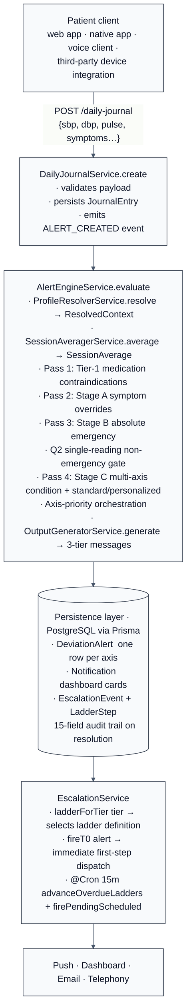

# Cardioplace v2 — Rule-Based Blood-Pressure Alert System

**Technical Disclosure Document**

_Document revision 2026-05-20. Authoritative implementation sources are the file paths cited inline._

---

## Abstract

A deterministic, rule-driven decision-support system for remote blood-pressure (BP) monitoring of cardiovascular-disease patients. The system constructs an immutable `ResolvedContext` per reading (verified condition profile, age stratum, active medications, optional provider thresholds, enrollment timestamp, practice assignment), passes it through a four-pass rule pipeline (profile-driven Tier-1 medication contraindications; symptom-driven tier elevation; absolute-emergency cutoffs; condition-aware multi-axis threshold evaluation behind a single-reading non-emergency gate), and routes each fired rule to one of seven clinical axes. At most one alert persists per axis per reading; rules on disjoint axes co-fire to produce multiple persisted rows from a single reading. A three-tier message generator emits patient-facing, caregiver-facing, and physician-facing strings from a static registry. A tier-specific escalation ladder advances by acknowledgement-aware time-based steps, queueing non-emergency dispatches until the assigned practice's business-hours window while emergencies bypass that queue. New default thresholds are introduced through a phased rollout keyed on enrollment date and practice name, with provider-set overrides always bypassing the rollout gate. A 15-field audit record is persisted on resolution of every non-dismissable alert.

---

## 1. Field

This document describes a deterministic, rule-driven decision-support system for the remote monitoring of blood-pressure (BP) readings reported by patients with established cardiovascular disease. The system ingests structured journal entries (systolic pressure, diastolic pressure, optional pulse rate, optional self-reported symptoms, optional medication-adherence reports), evaluates a multi-stage rule pipeline against a verified clinical profile, and emits one or more typed alert records (`DeviationAlert` rows). Each alert is routed through an escalation ladder that selects role-specific dispatch channels (push notification, dashboard, email, telephony) and timed re-prompts. Three context-aware natural-language strings (patient-facing, caregiver-facing, physician-facing) are persisted with each alert.

The system is designed for a multi-tenant care-team deployment in which a single backend instance serves multiple physician practices, each managing a roster of remotely-monitored patients with heterogeneous comorbidities, age strata, pregnancy status, and medication regimens.

---

## 2. Background

Conventional remote BP monitoring platforms in widespread clinical use share several limitations that the present system is designed to address.

**Limitation A — Single-threshold paradigm.** Most existing platforms compare each reported BP value against a single high/low threshold pair (commonly the population-level Stage 2 hypertension cutoffs 160/100 mmHg, or a single provider-set override). They do not vary the threshold by underlying condition (e.g. a CAD patient's clinically-meaningful systolic upper bound differs from a HFpEF patient's, and a pregnant patient's differs again). They also do not stratify low-pressure thresholds by age — fall-risk hypotension in patients aged 65+ is reached at higher systolic values than in younger patients. _(Addressed by §8.5.2–§8.5.8 condition branches and §8.5.8 age-stratified override.)_

**Limitation B — Single-axis alerting.** Conventional alert engines emit at most one alert per reading. When a single reading triggers concerns on two clinically independent axes — for example, a CAD patient whose reading is simultaneously above the systolic upper bound (`bp-high` axis) and at the J-curve diastolic low cutoff (`dbp-low` axis) — the patient and clinician see one of the two concerns and the other is silently suppressed. This loses safety-critical information. _(Addressed by §11 axis-based co-fire orchestration; worked examples in §17.1 and §17.6.)_

**Limitation C — Symptom-blind thresholds.** A patient with severe headache, visual changes, focal neurological deficit, or chest pain warrants escalation even when the measured BP value is within nominal limits. Conventional threshold engines treat the symptom as a separate event (or ignore it entirely), failing to elevate the tier of the BP alert that the same reading generated. _(Addressed by §8.2 Stage A symptom-driven tier elevation; worked example in §17.3.)_

**Limitation D — Single-reading noise.** A single anomalous reading is a notoriously noisy signal in home BP monitoring. Conventional engines either fire on every single reading (generating excess provider workload) or suppress all alerts until the patient has logged a configurable number of readings (creating dangerous emergency-class latency for patients with truly elevated BP). Neither extreme is acceptable. _(Addressed by §6 single-reading non-emergency gate with emergency bypass.)_

**Limitation E — Indiscriminate threshold rollouts.** When clinical guidance changes — for example, when a new specialty-society guideline lowers the recommended hypertension treatment target — conventional systems either (i) push the new threshold to all patients simultaneously, generating an alert-volume spike that overwhelms clinical operations, or (ii) require manual per-patient threshold updates, which scales poorly across large rosters. _(Addressed by §10 phased threshold rollout.)_

**Limitation F — Identical messaging for all roles.** Conventional engines surface the same alert text to the patient, the caregiver, and the clinician. The patient lacks plain-language context; the caregiver lacks instructions; the clinician lacks the granular trigger detail required for clinical decision-making and audit. _(Addressed by §12 three-tier message generation.)_

**Limitation G — Acknowledgement-blind re-prompts.** Time-based escalation ladders that re-page a clinician at fixed intervals (e.g. T+2h, T+4h) typically advance regardless of whether the prior step was acknowledged, producing pager noise after the clinician has already responded. _(Addressed by §14 acknowledgement-aware ladder advancement.)_

**Limitation H — Practice-blind after-hours behavior.** Routine (non-emergency) alerts dispatched outside a practice's business hours either go unread until morning (defeating real-time monitoring) or generate after-hours pages indistinguishable from emergencies. _(Addressed by §14 after-hours queueing with tier-specific dispatch windows.)_

The system described herein addresses each of these limitations through a deterministic multi-stage rule pipeline, an axis-based co-fire model, a single-reading gate that bypasses for emergencies, a phased rollout mechanism, a three-tier message registry, and an escalation ladder with selective time-anchored dispatch windows and acknowledgement-aware advancement.

---

## 3. System overview

The system comprises:

- A **profile resolver** that constructs an immutable `ResolvedContext` for each BP reading by combining the patient's verified clinical profile, age stratification, active medication list, optional provider-set personalized thresholds, enrollment timestamp, and practice assignment.
- A **session averager** that buffers consecutive BP readings within a session window and emits a smoothed `SessionAverage` along with a session-scoped reading count.
- A **multi-stage rule pipeline** comprising four passes that operate on the `ResolvedContext` + `SessionAverage`: (a) profile-driven Tier-1 medication contraindications, (b) Stage A symptom-driven tier elevation (single-reading), (c) Stage B absolute-emergency BP cutoffs (single-reading), and (d) Stage C multi-axis condition-aware threshold evaluation (gated by a single-reading non-emergency gate).
- An **axis-priority orchestrator** that maps each candidate alert to one of seven clinical axes and persists at most one alert per axis per reading, with axes drained in a fixed priority order.
- A **threshold-hierarchy resolver** that applies, in priority order, (i) a provider-set per-patient threshold override, (ii) a condition-specific spec default, (iii) a phased-rollout default (advanced by environment-configurable rollout-phase and rollout-start-date parameters and by per-practice activation rules).
- A **three-tier message generator** that selects role-specific natural-language strings from a static registry keyed on rule identifier and BP-tier, with mode-aware (standard vs personalized) and disclaimer-aware (pre-baseline) suffixes.
- An **escalation ladder** module that selects a tier-specific ladder definition, fires the T+0 step immediately upon persistence, and advances overdue steps via a periodic cron task that excludes acknowledged alerts.
- A **practice-aware dispatch scheduler** that for non-emergency tiers queues dispatch until the assigned practice's next business-hours window, while emergency tiers fire immediately regardless of time of day.
- A **15-field audit trail** persisted on resolution of every Tier-1-class and BP-Level-2 alert.

The high-level flow is depicted in Figure 1 (§23 below).

---

## 4. System architecture

### 4.1 Component diagram



### 4.2 Data model essentials

The relational store carries (Prisma schema files in `backend/prisma/schema/`):

| Entity | Role |
|---|---|
| `User` | Patient identity, role, `dateOfBirth`, `enrolledAt`, `preferredLanguage`, practice assignment |
| `PatientProfile` | Verified booleans: `isPregnant`, `hasCAD`, `hasHFrEF`, `hasHFpEF`, `hasHCM`, `hasDCM`, `hasAFib`, `hasBradycardia`, `hasHeartFailure`, plus derived `resolvedHFType` |
| `PatientThreshold` | Optional per-patient overrides: `sbpUpperTarget`, `sbpLowerTarget`, `dbpUpperTarget`, `dbpLowerTarget` |
| `PatientMedication` | Active medications with `drugClass` enum (`ACE_INHIBITOR`, `ARB`, `BETA_BLOCKER`, `DHP_CCB`, `NON_DHP_CCB`, `VASODILATOR_NITRATE`, `LOOP_DIURETIC`, etc.) |
| `JournalEntry` | One BP reading + associated symptoms; immutable once persisted |
| `DeviationAlert` | One row per fired rule per journal entry; carries `tier`, `ruleId`, `mode`, `actualValue`, `patientMessage`, `caregiverMessage`, `physicianMessage`, three-tier audit fields |
| `EscalationEvent` | 15-field Joint-Commission-compliant audit record generated on resolution |
| `Practice` | Tenant entity with business-hours configuration and backup-provider chain |

### 4.3 ResolvedContext

The `ResolvedContext` (shape declared in `shared/src/index.ts`) is the immutable input passed to every rule function:

```ts
interface ResolvedContext {
  profile: ResolvedProfile          // verified condition booleans + resolvedHFType
  ageGroup: '<65' | '65+'           // derived from User.dateOfBirth
  contextMeds: ContextMed[]         // active PatientMedication rows (drugClass + drugName)
  threshold: PatientThreshold | null
  readingCount: number              // sessionId-scoped count
  preDay3Mode: boolean              // readingCount < 7  (mode forced to STANDARD)
  personalizedEligible: boolean     // threshold != null AND readingCount ≥ 7
  enrolledAt: Date | null
  practiceName: string | null
}
```

Rule functions are pure with respect to `(SessionAverage, ResolvedContext)` — they receive both, produce a `RuleResult | null`, and have no side effects. The orchestrator decides which results to persist.

---

## 5. Patient profile resolution

`ProfileResolverService.resolve(userId)` returns a `ResolvedContext`. Two implementation features warrant note:

**Trust-then-verify intake.** A patient may self-report their clinical condition list at sign-up and begin receiving condition-aware alerts immediately. A provider has 48–72 hours to review the self-reported profile via the admin portal, at which point the profile transitions from `PROVISIONAL` to `VERIFIED`. The alert engine treats a `PROVISIONAL` profile identically to a `VERIFIED` profile for the purpose of rule evaluation (because withholding condition-aware alerts during the verification window would be clinically unsafe), but the persisted `DeviationAlert.profileState` field records which state was in effect at evaluation time, supporting later forensic review.

**Resolved heart-failure type.** Some clinical conditions overlap (a patient with DCM is managed clinically as HFrEF; a patient with both `hasHFrEF=true` and `hasDCM=true` should not be evaluated by both rule branches). The resolver computes a single derived field `resolvedHFType ∈ {HFREF, HFPEF, null}` that each rule branch keys on (e.g. `dcmRule` early-returns when `profile.hasHeartFailure === true`, deferring to the HFrEF branch).

---

## 6. Session averaging and the single-reading gate

The session averager (`SessionAveragerService.average(userId, sessionId)`) returns a `SessionAverage`:

```ts
interface SessionAverage {
  systolicBP: number | null         // mean SBP over all readings in the session
  diastolicBP: number | null        // mean DBP
  pulseRate: number | null          // mean pulse
  symptoms: SymptomFlags            // OR-reduced over all readings in the session
  readingCount: number              // count of readings already in this session
  sessionId: string
  suboptimalMeasurement: boolean    // OR-reduced quality flag
}
```

A **session** is a logical grouping of readings the patient took close together — typically two or three readings two minutes apart, per AHA technique guidance for self-measured BP. The averager assigns a `sessionId` upon receipt of the first reading and continues attributing subsequent readings to the same session for a configurable window (default 5 minutes, per CLINICAL_SPEC §5.2). Symptoms recorded on any reading in the session apply to the session-level evaluation via an OR reduction.

**Single-reading non-emergency gate (`Q2 gate`).** When the session contains only one reading (`readingCount < 2`), an additional flag `singleReadingFinalized` has not been set, the patient is not in their pre-baseline window (`!preDay3Mode`), and the patient does not have atrial fibrillation (`!hasAFib`), the engine **withholds** all non-emergency BP rows produced by Stage C. The journal-entry response carries `pendingSecondReading: true`, prompting the client UI to ask the patient to take a second reading. The held rows fire when (a) a second reading arrives within the same `sessionId`, at which point the averager mean reflects both readings, or (b) the client posts a 5-minute finalize endpoint that sets `singleReadingFinalized = true`, releasing the held rows on the original single reading.

The Q2 gate is bypassed for emergencies: Stage A symptom overrides and Stage B absolute emergencies fire on the first reading regardless of the gate. AFib patients have a separate `≥3-reading gate` that suppresses both Stage B and Stage C until the patient has logged three readings (since AFib produces beat-to-beat variability that a single reading cannot resolve).

---

## 7. Mode resolution

Every BP alert carries a `mode ∈ {STANDARD, PERSONALIZED}`. The mode is determined by the following rules, evaluated in order:

| Condition | Resulting `mode` |
|---|---|
| `readingCount < 7` (pre-baseline window) | `STANDARD` (forced; the patient-facing message appends a disclaimer that personalization activates after the first week of monitoring) |
| `PatientThreshold` row exists for this patient AND `readingCount ≥ 7` | `PERSONALIZED` (personalized rules become eligible to fire) |
| Otherwise | `STANDARD` |

The mode affects (i) which rules are eligible to fire — `personalizedHighRule` and `personalizedLowRule` only run when `personalizedEligible === true` — and (ii) the patient-facing wording (the `STANDARD` mode wording includes the pre-baseline disclaimer when `preDay3Mode === true`).

Provider-set thresholds **always override** the spec defaults inside condition branches regardless of mode — even in `STANDARD` mode, a provider's per-patient `sbpUpperTarget` overrides the condition's default upper bound. Mode resolution affects which standalone rules iterate; it does not gate threshold override behaviour inside condition branches.

---

## 8. Multi-stage rule pipeline

### 8.1 Tier-1 medication contraindications

The first pass evaluates two profile-driven contraindication rules. These rules produce a `TIER_1_CONTRAINDICATION` row (non-dismissable) whenever the contraindication holds — they have no BP threshold gate, no session gate, and no rollout gate.

| Rule | Trigger | Source |
|---|---|---|
| `RULE_PREGNANCY_ACE_ARB` | `profile.isPregnant === true` AND active medication's `drugClass ∈ {ACE_INHIBITOR, ARB}` | [contraindications.ts:19](backend/src/daily_journal/engine/contraindications.ts#L19) |
| `RULE_NDHP_HFREF` | `profile.hasHFrEF === true` AND active medication's `drugClass === NON_DHP_CCB` (diltiazem, verapamil) | [contraindications.ts:68](backend/src/daily_journal/engine/contraindications.ts#L68) |

These rules fire on every reading as long as the contraindication holds. The orchestrator's `journalEntryId + ruleId` upsert ensures only one persisted row per journal entry, and the ladder's pending-step de-duplication prevents repeated dispatches once an unresolved contraindication alert already exists. The `physicianMessage` includes the offending drug class and (where applicable) the specific drug name extracted from the verified `PatientMedication` row.

### 8.2 Stage A — symptom-driven tier elevation

This stage emits a `BP_LEVEL_2_SYMPTOM_OVERRIDE` row whenever a designated symptom set is present, **regardless of the measured BP value**. The two rules share a single Axis (`emergency`); the pregnancy-specific rule is evaluated first so that a pregnant patient receives the preeclampsia-framed wording rather than the generic emergency-symptom wording.

| Rule | Trigger | Source |
|---|---|---|
| `RULE_SYMPTOM_OVERRIDE_PREGNANCY` | `profile.isPregnant === true` AND any of `{newOnsetHeadache, ruqPain, edema}` set | [symptom-override.ts:53](backend/src/daily_journal/engine/symptom-override.ts#L53) |
| `RULE_SYMPTOM_OVERRIDE_GENERAL` | Any of `{severeHeadache, visualChanges, alteredMentalStatus, chestPainOrDyspnea, focalNeuroDeficit, severeEpigastricPain, ruqPain}` set | [symptom-override.ts:20](backend/src/daily_journal/engine/symptom-override.ts#L20) |

The pregnancy override claims the `emergency` axis first; when both rules would fire on the same reading, the general rule's would-be alert is dropped and the suppression is logged for forensic review. Right-upper-quadrant pain (`ruqPain`) appears in both lists — in a pregnant patient it is treated as a preeclampsia indicator; in a non-pregnant patient it is treated as a general acute-abdomen indicator.

Stage A bypasses the Q2 single-reading gate — a patient reporting severe headache on a first reading must be escalated immediately.

### 8.3 Stage B — absolute emergency

| Rule | Trigger | Source |
|---|---|---|
| `RULE_ABSOLUTE_EMERGENCY` | `SBP ≥ 180` mmHg OR `DBP ≥ 120` mmHg | [absolute-emergency.ts:7](backend/src/daily_journal/engine/absolute-emergency.ts#L7) |

Tier `BP_LEVEL_2`. Single reading; bypasses Q2 gate. The patient-facing message includes a 911 call-to-action.

### 8.4 Q2 single-reading non-emergency gate

Evaluated after Stage B and before Stage C. The gate is described in §6. If the gate holds, Stage C output is buffered and the response carries `pendingSecondReading: true`. If the gate releases, Stage C executes.

### 8.5 Stage C — multi-axis condition-aware evaluation

Stage C iterates condition-specific branches **before** the standard/personalized branches. Each rule that fires claims a single `Axis`; once an axis is claimed, later rules that would have iterated on the same axis are silently dropped (logged for forensic review but not persisted). This produces the desired co-fire behavior: a CAD patient at 145/95 fires both `RULE_CAD_HIGH` (axis `bp-high`) and `RULE_CAD_DBP_HIGH` (axis `dbp-high`) — two persisted rows on two independent axes — while a HFrEF patient at 78/55 fires only `RULE_HFREF_LOW` (axis `sbp-low`); the would-be `RULE_STANDARD_L1_LOW` is dropped because it claims the same axis after the condition rule has already taken it.

#### 8.5.1 Pregnancy thresholds (`profile.isPregnant === true`)

| Rule | Trigger | Tier | Axis |
|---|---|---|---|
| `RULE_PREGNANCY_L2` | `SBP ≥ 160` OR `DBP ≥ 110` | `BP_LEVEL_2` | `emergency` |
| `RULE_PREGNANCY_L1_HIGH` | `SBP ≥ 140` OR `DBP ≥ 90` | `BP_LEVEL_1_HIGH` | `bp-high` |

Source: [pregnancy-thresholds.ts:14](backend/src/daily_journal/engine/pregnancy-thresholds.ts#L14).

#### 8.5.2 Heart-failure branches

Each branch is gated on `resolvedHFType`. Within each branch, the resolved upper and lower bounds are sourced via the threshold hierarchy (§9).

| Rule | Gate | Default lower | Default upper | Tier | Axis |
|---|---|---|---|---|---|
| `RULE_HFREF_LOW` | `resolvedHFType === 'HFREF'` | `85` | — | `BP_LEVEL_1_LOW` | `sbp-low` |
| `RULE_HFREF_HIGH` | `resolvedHFType === 'HFREF'` | — | `160` | `BP_LEVEL_1_HIGH` | `bp-high` |
| `RULE_HFPEF_LOW` | `resolvedHFType === 'HFPEF'` | `110` | — | `BP_LEVEL_1_LOW` | `sbp-low` |
| `RULE_HFPEF_HIGH` | `resolvedHFType === 'HFPEF'` | — | `160` | `BP_LEVEL_1_HIGH` | `bp-high` |

#### 8.5.3 Coronary artery disease branches — three-axis split

The CAD path is structurally distinctive: it comprises three independent rules on three independent axes, all gated on `profile.hasCAD === true`. This split allows a single reading from a CAD patient to fire up to three independent persisted alert rows, one per axis, surfacing the three clinically distinct concerns simultaneously rather than collapsing them into a single ambiguous alert.

| Rule | Trigger | Default threshold | Tier | Axis |
|---|---|---|---|---|
| `RULE_CAD_DBP_CRITICAL` | `DBP < 70` (J-curve / coronary perfusion concern) | `70` | `BP_LEVEL_1_LOW` | `dbp-low` |
| `RULE_CAD_HIGH` | `SBP ≥ cadDefaultUpper(ctx)` | `140` post-ramp / `160` pre-ramp | `BP_LEVEL_1_HIGH` | `bp-high` |
| `RULE_CAD_DBP_HIGH` | `DBP ≥ 80` (ramp-gated when default applies) | `80` | `BP_LEVEL_1_HIGH` | `dbp-high` |

Source: [condition-branches.ts:127](backend/src/daily_journal/engine/condition-branches.ts#L127), [condition-branches.ts:144](backend/src/daily_journal/engine/condition-branches.ts#L144), [condition-branches.ts:160](backend/src/daily_journal/engine/condition-branches.ts#L160).

The `dbp-high` axis is introduced specifically to permit `RULE_CAD_DBP_HIGH` to co-fire with `RULE_CAD_HIGH` (which claims the `bp-high` axis). Conventional single-axis engines would suppress one of the two; the present system surfaces both, supporting the clinical decision to change medication class (rather than reduce dose) when both axes are simultaneously elevated.

Additionally, a **physician-facing bidirectional annotation** is generated when a CAD patient triggers `RULE_CAD_DBP_CRITICAL` (J-curve diastolic-low) and the same reading's systolic is in the range `(140, 160)`. The function `getCadHtnUncontrolledAnnotation` ([condition-branches.ts:196](backend/src/daily_journal/engine/condition-branches.ts#L196)) emits the annotation `"SBP X also above CAD goal of 130/80 — consider switching antihypertensive class rather than dose reduction"`, which is appended to the J-curve row's `physicianMessage`. This is structurally important: the dominant J-curve alert otherwise reads as "drop the dose" — risking systolic rebound when the patient actually needs a class switch. The annotation's lower bound of 140 corresponds to the Stage-2 hypertension boundary; the upper bound of 160 is the threshold above which `RULE_CAD_HIGH` would fire its own `bp-high` row, making the annotation redundant.

#### 8.5.4 Hypertrophic cardiomyopathy branches — three-rule split

Three rules, all gated on `profile.hasHCM === true`.

| Rule | Trigger | Default | Tier | Axis |
|---|---|---|---|---|
| `RULE_HCM_LOW` | `SBP < threshold.sbpLowerTarget ?? 100` | `100` | `BP_LEVEL_1_LOW` | `sbp-low` |
| `RULE_HCM_HIGH` | `SBP ≥ threshold.sbpUpperTarget ?? 160` | `160` | `BP_LEVEL_1_HIGH` | `bp-high` |
| `RULE_HCM_VASODILATOR` | Active medication's `drugClass ∈ {VASODILATOR_NITRATE, DHP_CCB, LOOP_DIURETIC}` | — | `TIER_3_INFO` | `info` |

Source: [condition-branches.ts:213](backend/src/daily_journal/engine/condition-branches.ts#L213).

The vasodilator rule was previously implemented as an early-return that suppressed `HCM_LOW` whenever the medication safety flag was active; this masked clinically meaningful hypotension in HCM patients. The current implementation routes the vasodilator rule to its own `info` axis (Tier 3, physician-only, dismissable), so that the patient's actual hypotension still produces a `BP_LEVEL_1_LOW` row from `HCM_LOW`.

`RULE_HCM_LOW`'s patient-facing message includes specific under-perfusion guidance for HCM patients (who are preload-dependent and may experience reduced systemic perfusion at moderately low systolic pressures).

#### 8.5.5 Dilated cardiomyopathy branches

Two rules, gated on `profile.hasDCM === true` AND `profile.hasHeartFailure === false`. (When a DCM patient also carries a heart-failure flag, the HFrEF branch handles them — the resolved HF type is `HFREF` in both cases.)

| Rule | Default lower | Default upper | Tier | Axis |
|---|---|---|---|---|
| `RULE_DCM_LOW` | `85` | — | `BP_LEVEL_1_LOW` | `sbp-low` |
| `RULE_DCM_HIGH` | — | `160` | `BP_LEVEL_1_HIGH` | `bp-high` |

#### 8.5.6 Personalized rules

Eligible only when `personalizedEligible === true` (provider-set threshold present AND `readingCount ≥ 7`). The two personalized rules are **asymmetric** with respect to the provider-set target: the high-side rule applies an additive band above the target, while the low-side rule fires immediately below the target.

| Rule | Trigger | Default band | Tier |
|---|---|---|---|
| `RULE_PERSONALIZED_HIGH` | `SBP ≥ threshold.sbpUpperTarget + PERSONALIZED_BAND_MMHG` | `PERSONALIZED_BAND_MMHG = 20` | `BP_LEVEL_1_HIGH` |
| `RULE_PERSONALIZED_LOW` | `SBP < threshold.sbpLowerTarget` | — (no band) | `BP_LEVEL_1_LOW` |

The +20 mmHg band on the high-side rule prevents nuisance alerting on readings within the expected day-to-day variation of a patient who has been calibrated to their personalized upper target — a patient with `sbpUpperTarget = 130` does not fire `RULE_PERSONALIZED_HIGH` until the session-averaged SBP reaches 150. The low-side rule has no analogous band because hypotension carries more immediate clinical risk and the standard rule's `SBP < 90` floor already provides a noise-tolerant lower bound for any patient whose personalized lower target is set above 90. Source: [personalized.ts:7](backend/src/daily_journal/engine/personalized.ts#L7).

These iterate after condition branches and only claim an axis the condition branches did not already take. They produce alerts carrying `mode = 'PERSONALIZED'`, and the patient-facing wording substitutes the patient's individualized targets in place of the population-default language.

#### 8.5.7 Standard rules

| Rule | Trigger | Tier |
|---|---|---|
| `RULE_STANDARD_L1_HIGH` | `SBP ≥ 160` OR `DBP ≥ 100` (AHA 2025 Severe Stage 2) | `BP_LEVEL_1_HIGH` |
| `RULE_STANDARD_L1_LOW` | `SBP < 90` AND `ageGroup !== '65+'` | `BP_LEVEL_1_LOW` |

#### 8.5.8 Age-stratified low-pressure override

| Rule | Trigger | Tier |
|---|---|---|
| `RULE_AGE_65_LOW` | `ageGroup === '65+'` AND `SBP < 100` | `BP_LEVEL_1_LOW` |

Source: [standard.ts:41](backend/src/daily_journal/engine/standard.ts#L41).

`RULE_AGE_65_LOW` and `RULE_STANDARD_L1_LOW` are mutually exclusive (the implementation selects between them based on `ageGroup`). However, `RULE_AGE_65_LOW` claims only the `sbp-low` axis; a CAD patient who is 65+ at SBP 95 with DBP 62 fires both `RULE_AGE_65_LOW` (on `sbp-low`) **and** `RULE_CAD_DBP_CRITICAL` (on `dbp-low`). The two rules coexist on disjoint axes by design — the J-curve diastolic concern and the age-stratified fall-risk concern are clinically distinct.

#### 8.5.9 Physician-only annotations

Three rules emit `TIER_3_INFO` rows or `physicianAnnotations` that ride on the primary BP row when one exists:

| Rule | Trigger | Behaviour |
|---|---|---|
| `RULE_PULSE_PRESSURE_WIDE` | `SBP − DBP > 60` mmHg (strict) | When a primary BP row fired on the same reading, the wide-PP wording is appended to that row's `physicianMessage` via `RuleResult.metadata.physicianAnnotations`. Standalone `TIER_3_INFO` row only when nothing else fired. Empty patient/caregiver text. |
| `RULE_LOOP_DIURETIC_HYPOTENSION` | Active loop diuretic on med list AND `SBP < 90` (strict, `LOOP_SENSITIVITY_SBP`) AND patient is **not** heart-failure (excludes HFrEF / HFpEF / DCM / `hasHeartFailure`) | Standalone `TIER_3_INFO` physician-only row reminding the provider of increased hypotension sensitivity. The HF-patient exclusion prevents duplicate provider noise: HFrEF / HFpEF / DCM rules already fire on the appropriate SBP thresholds, so the loop-diuretic surface would be redundant for those cohorts. |
| `getCadHtnUncontrolledAnnotation` (function, not a standalone rule) | `hasCAD` AND `SBP ∈ (140, 160)` strict open interval AND a CAD DBP-low row fires | Appends class-switch guidance to the J-curve row's `physicianMessage`. |

Source: [pulse-pressure.ts:14](backend/src/daily_journal/engine/pulse-pressure.ts#L14), [loop-diuretic.ts:16](backend/src/daily_journal/engine/loop-diuretic.ts#L16), [condition-branches.ts:196](backend/src/daily_journal/engine/condition-branches.ts#L196).

---

## 9. Threshold hierarchy

For each rule that uses a threshold, the effective value is resolved by the following hierarchy, evaluated in order, taking the first non-null value:

1. **Provider-set per-patient threshold.** `PatientThreshold.sbpUpperTarget` / `.sbpLowerTarget` / `.dbpUpperTarget` / `.dbpLowerTarget`. A provider-set value is treated as an explicit clinical decision and **always wins**, including over the phased-rollout gate (§10).
2. **Phased-rollout default.** For thresholds subject to a phased rollout (currently the CAD systolic upper bound and the CAD diastolic upper bound), `cadDefaultUpper(ctx)` returns the new default value when the rollout has reached this patient, else the prior default. See §10.
3. **Spec default.** The condition-specific compile-time constant declared at the top of the rule's source file.

This hierarchy is uniform across condition branches. A provider editing a patient's `sbpUpperTarget` in the admin portal therefore (i) overrides whatever the spec default and rollout state would have produced, (ii) flips the alert's `mode` to `PERSONALIZED` once the reading-count gate is also satisfied, and (iii) substitutes the patient's individualized target into the patient-facing message wording.

### 9.1 Complete threshold catalog

The following table is the single point of reference for every numerical threshold used by the BP rule pipeline. Each constant is declared at the top of the cited source file; the rule listed is the one that consumes the constant. Defaults marked **(provider-overridable)** are sourced through the threshold hierarchy above and are read from `PatientThreshold` when a provider has set a custom value. Heart-rate constants and side-effect rules are out of scope for this document.

| Constant | Value | Unit | Rule(s) | Source | Override? |
|---|---|---|---|---|---|
| Absolute-emergency SBP | `≥ 180` | mmHg | `RULE_ABSOLUTE_EMERGENCY` | [absolute-emergency.ts:12](backend/src/daily_journal/engine/absolute-emergency.ts#L12) | hardcoded |
| Absolute-emergency DBP | `≥ 120` | mmHg | `RULE_ABSOLUTE_EMERGENCY` | [absolute-emergency.ts:13](backend/src/daily_journal/engine/absolute-emergency.ts#L13) | hardcoded |
| `PREGNANCY_L2_SBP` | `≥ 160` | mmHg | `RULE_PREGNANCY_L2` | [pregnancy-thresholds.ts:9](backend/src/daily_journal/engine/pregnancy-thresholds.ts#L9) | hardcoded |
| `PREGNANCY_L2_DBP` | `≥ 110` | mmHg | `RULE_PREGNANCY_L2` | [pregnancy-thresholds.ts:10](backend/src/daily_journal/engine/pregnancy-thresholds.ts#L10) | hardcoded |
| `PREGNANCY_L1_SBP` | `≥ 140` | mmHg | `RULE_PREGNANCY_L1_HIGH` | [pregnancy-thresholds.ts:11](backend/src/daily_journal/engine/pregnancy-thresholds.ts#L11) | hardcoded |
| `PREGNANCY_L1_DBP` | `≥ 90` | mmHg | `RULE_PREGNANCY_L1_HIGH` | [pregnancy-thresholds.ts:12](backend/src/daily_journal/engine/pregnancy-thresholds.ts#L12) | hardcoded |
| `HFREF_DEFAULT_LOWER` | `85` (fires SBP `<`) | mmHg | `RULE_HFREF_LOW` | [condition-branches.ts:9](backend/src/daily_journal/engine/condition-branches.ts#L9) | provider-overridable (`sbpLowerTarget`) |
| `HFREF_DEFAULT_UPPER` | `160` (fires SBP `≥`) | mmHg | `RULE_HFREF_HIGH` | [condition-branches.ts:10](backend/src/daily_journal/engine/condition-branches.ts#L10) | provider-overridable (`sbpUpperTarget`) |
| `HFPEF_DEFAULT_LOWER` | `110` (fires SBP `<`) | mmHg | `RULE_HFPEF_LOW` | [condition-branches.ts:11](backend/src/daily_journal/engine/condition-branches.ts#L11) | provider-overridable (`sbpLowerTarget`) |
| `HFPEF_DEFAULT_UPPER` | `160` (fires SBP `≥`) | mmHg | `RULE_HFPEF_HIGH` | [condition-branches.ts:12](backend/src/daily_journal/engine/condition-branches.ts#L12) | provider-overridable (`sbpUpperTarget`) |
| `HCM_DEFAULT_LOWER` | `100` (fires SBP `<`) | mmHg | `RULE_HCM_LOW` | [condition-branches.ts:13](backend/src/daily_journal/engine/condition-branches.ts#L13) | provider-overridable (`sbpLowerTarget`) |
| `HCM_DEFAULT_UPPER` | `160` (fires SBP `≥`) | mmHg | `RULE_HCM_HIGH` | [condition-branches.ts:14](backend/src/daily_journal/engine/condition-branches.ts#L14) | provider-overridable (`sbpUpperTarget`) |
| `DCM_DEFAULT_LOWER` | `85` (fires SBP `<`) | mmHg | `RULE_DCM_LOW` | [condition-branches.ts:15](backend/src/daily_journal/engine/condition-branches.ts#L15) | provider-overridable (`sbpLowerTarget`) |
| `DCM_DEFAULT_UPPER` | `160` (fires SBP `≥`) | mmHg | `RULE_DCM_HIGH` | [condition-branches.ts:16](backend/src/daily_journal/engine/condition-branches.ts#L16) | provider-overridable (`sbpUpperTarget`) |
| `CAD_DBP_CRITICAL` | `70` (fires DBP `<`) | mmHg | `RULE_CAD_DBP_CRITICAL` | [condition-branches.ts:17](backend/src/daily_journal/engine/condition-branches.ts#L17) | hardcoded (J-curve) |
| `CAD_DEFAULT_UPPER` | `160` (fires SBP `≥`) | mmHg | `RULE_CAD_HIGH` pre-ramp | [condition-branches.ts:18](backend/src/daily_journal/engine/condition-branches.ts#L18) | provider-overridable + phased-rollout |
| `CAD_NEW_DEFAULT_UPPER` | `140` (fires SBP `≥`) | mmHg | `RULE_CAD_HIGH` post-ramp | [condition-branches.ts:21](backend/src/daily_journal/engine/condition-branches.ts#L21) | provider-overridable + phased-rollout |
| `CAD_DBP_HIGH_DEFAULT` | `80` (fires DBP `≥`) | mmHg | `RULE_CAD_DBP_HIGH` | [condition-branches.ts:26](backend/src/daily_journal/engine/condition-branches.ts#L26) | provider-overridable + phased-rollout (`dbpUpperTarget`) |
| `CAD_HTN_UNCONTROLLED_FLOOR` | `> 140` | mmHg | `getCadHtnUncontrolledAnnotation` | [condition-branches.ts:193](backend/src/daily_journal/engine/condition-branches.ts#L193) | hardcoded |
| `CAD_HTN_UNCONTROLLED_CEILING` | `< 160` | mmHg | `getCadHtnUncontrolledAnnotation` | [condition-branches.ts:194](backend/src/daily_journal/engine/condition-branches.ts#L194) | hardcoded |
| `STANDARD_SEVERE_STAGE2_SBP` | `≥ 160` | mmHg | `RULE_STANDARD_L1_HIGH` | [standard.ts:7](backend/src/daily_journal/engine/standard.ts#L7) | hardcoded |
| `STANDARD_SEVERE_STAGE2_DBP` | `≥ 100` | mmHg | `RULE_STANDARD_L1_HIGH` | [standard.ts:8](backend/src/daily_journal/engine/standard.ts#L8) | hardcoded |
| `STANDARD_LOW_SBP` | `< 90` | mmHg | `RULE_STANDARD_L1_LOW` (age `< 65`) | [standard.ts:9](backend/src/daily_journal/engine/standard.ts#L9) | hardcoded |
| `AGE_65_LOW_SBP` | `< 100` | mmHg | `RULE_AGE_65_LOW` (age `≥ 65`) | [standard.ts:10](backend/src/daily_journal/engine/standard.ts#L10) | hardcoded |
| `PERSONALIZED_BAND_MMHG` | `+ 20` | mmHg | `RULE_PERSONALIZED_HIGH` (fires when `SBP ≥ threshold.sbpUpperTarget + 20`) | [personalized.ts:7](backend/src/daily_journal/engine/personalized.ts#L7) | hardcoded; band is additive on the provider-set target |
| Personalized low | `< threshold.sbpLowerTarget` (no band) | mmHg | `RULE_PERSONALIZED_LOW` | [personalized.ts:31](backend/src/daily_journal/engine/personalized.ts#L31) | provider-set lower target, no additive band |
| `WIDE_PP_THRESHOLD` | `> 60` (strict) | mmHg | `RULE_PULSE_PRESSURE_WIDE` | [pulse-pressure.ts:12](backend/src/daily_journal/engine/pulse-pressure.ts#L12) | hardcoded |
| `LOOP_SENSITIVITY_SBP` | `< 90` (strict) | mmHg | `RULE_LOOP_DIURETIC_HYPOTENSION` (also requires non-HF) | [loop-diuretic.ts:14](backend/src/daily_journal/engine/loop-diuretic.ts#L14) | hardcoded |
| Pre-baseline reading count | `< 7` | readings | Forces `STANDARD` mode + appends pre-baseline disclaimer | [shared/src/index.ts](shared/src/index.ts) | hardcoded |
| Personalized-eligibility reading count | `≥ 7` AND `threshold != null` | readings | Enables `PERSONALIZED` mode + personalized rules | [shared/src/index.ts](shared/src/index.ts) | hardcoded |
| Q2 single-reading gate | `readingCount < 2` (in-session) | readings | Holds non-emergency Stage C output (§6) | [session-averager.service.ts](backend/src/daily_journal/services/session-averager.service.ts) | hardcoded; 5-minute finalize endpoint releases |
| AFib emergency gate | `readingCount < 3` | readings | Suppresses Stage B + Stage C for AFib patients | [alert-engine.service.ts](backend/src/daily_journal/services/alert-engine.service.ts) | hardcoded |
| Session-window length | `10` (default) | minutes | Sub-sequent readings within the window attach to the same `sessionId` | [session-averager.service.ts](backend/src/daily_journal/services/session-averager.service.ts) | configurable |

**Configuration parameters** (rollout state, not BP thresholds):

| Parameter | Default | Effect |
|---|---|---|
| `CAD_THRESHOLD_ROLLOUT_PHASE` | `1` | Advances the CAD ramp activation (`1` newly-enrolled only; `2` adds the designated lead practice; `3` activates for all CAD) |
| `CAD_ROLLOUT_START` | `2026-05-18T00:00:00Z` | Anchor timestamp for the "newly enrolled" cohort in Phase 1 |

---

## 10. Phased threshold rollout

Net-new alerting volume — for example, lowering the CAD systolic upper bound from 160 to 140 mmHg per updated specialty guidance — is gated behind a configurable phased rollout. The rollout supports a graduated activation pattern: newly-enrolled patients first, a designated lead practice next, then the remainder of the affected cohort.

The rollout state is determined by two environment-configurable parameters and one per-patient timestamp:

```ts
function cadRampApplies(ctx: ResolvedContext): boolean {
  const phase = cadRolloutPhase()                        // env CAD_THRESHOLD_ROLLOUT_PHASE (1|2|3, default 1)
  if (phase >= 3) return true                            // Phase 3: all CAD patients

  const newlyEnrolled =
    ctx.enrolledAt != null &&
    ctx.enrolledAt.getTime() >= cadRolloutStart().getTime()
  if (newlyEnrolled) return true                         // Phase 1: anchor-date-onward enrollment

  if (phase >= 2) {
    const atCedarHill = (ctx.practiceName ?? '')
      .toLowerCase()
      .includes('cedar hill')
    if (atCedarHill) return true                         // Phase 2: + designated lead practice
  }
  return false
}
```

Source: [condition-branches.ts:61](backend/src/daily_journal/engine/condition-branches.ts#L61).

Three operational features of the rollout warrant note:

**(a) Provider override bypass.** A `PatientThreshold.sbpUpperTarget` or `dbpUpperTarget` set by a provider is treated as an explicit clinical decision and is applied regardless of the rollout phase. The phased rollout only supplies the default value when no provider override exists.

**(b) One-time provider notice.** On the first-ever firing of `RULE_CAD_HIGH` for a given CAD patient where (i) no custom threshold has been set, and (ii) the new default produced the alert (i.e. the alert would not have fired under the prior default), the engine writes a single `DASHBOARD` Notification addressed to the primary provider explaining the threshold update. Idempotency is enforced by checking `DeviationAlert.count({userId, ruleId: 'RULE_CAD_HIGH'}) === 1` — only the first fired alert triggers the notice.

**(c) Persistent admin-side disclosure.** The admin patient-detail Profile tab renders a persistent informational banner for every CAD patient, regardless of whether any alert has fired. The banner discloses the AHA/ACC treatment target (130/80), the engine's active default thresholds for this patient (`SBP ≥ X / DBP ≥ Y / DBP < 70 low`), and a hyperlink to the Thresholds tab for per-patient customization. This addresses the discoverability concern that arises when threshold defaults change asynchronously across a rostered cohort.

---

## 11. Axis-based co-fire orchestration

The orchestrator maintains a `claimed: Map<Axis, RuleResult>` initialized empty per evaluation. Each rule that fires claims exactly one Axis; if the axis is already claimed by an earlier rule, the later rule's would-be alert is dropped (and the suppression is logged at `DEBUG`).

The set of axes and their priority order is:

```
emergency  →  contraindication  →  bp-high  →  dbp-high  →  sbp-low  →  dbp-low  →  hr  →  hf-decomp  →  info
```

`axisFor(ruleId)` ([alert-engine.service.ts](backend/src/daily_journal/services/alert-engine.service.ts)) is a static mapping from rule identifier to axis. New rules require both an entry in the rule-identifier registry and an `axisFor` mapping; an automated registry-completeness test asserts every `RULE_IDS.*` value has both a message-registry entry and an axis mapping, preventing accidental omission.

**Iteration order within Stage C.** Condition branches iterate first (HF, CAD, HCM, DCM), then personalized rules, then standard rules. This ensures condition rules claim their axes first — a HFrEF patient at SBP 78 fires `RULE_HFREF_LOW` (axis `sbp-low`), and `RULE_STANDARD_L1_LOW` (which would also have hit on `sbp-low`) is silently dropped. The patient receives one BP-Level-1-Low alert with the HFrEF-specific patient-facing wording rather than the generic standard-mode wording.

**Co-fire across disjoint axes.** As described in §8.5.3 and §8.5.8, a single reading may produce multiple persisted rows when the rules claim disjoint axes. The architectural insight is that BP concerns are not one-dimensional — a single reading from a CAD patient can simultaneously present an above-goal systolic concern (bp-high), a diastolic uncontrolled-HTN concern (dbp-high), and a J-curve perfusion concern (dbp-low). The axis model preserves all three signals.

---

## 12. Three-tier message generation

Every persisted alert carries three role-specific natural-language strings, generated by `OutputGeneratorService.generate(ruleId, tier, mode, context, ruleResult)`:

| Field | Audience | Characteristics |
|---|---|---|
| `patientMessage` | Patient | Plain-language, warm, action-oriented. `BP_LEVEL_2*` includes a 911 call-to-action; `BP_LEVEL_1_*` says "please contact your care team today." `STANDARD` mode in the pre-baseline window appends the personalization disclaimer. Failed measurement-checklist items append the retake suffix. |
| `caregiverMessage` | Designated caregiver | Second-person plural, same urgency level. Populated for every BP alert and persisted for audit; dispatch is currently gated behind `CAREGIVER_DISPATCH_ENABLED` (an operational rollout flag). |
| `physicianMessage` | Clinician | Clinical shorthand: `tier | ruleId | threshold | sbp/dbp(context) | mode-aware notes | physicianAnnotations`. Includes the triggering numeric value with its axis (e.g. `"165 mmHg (systolic)"`), the threshold that was breached, any annotations from §8.5.9, and a single-reading caveat where applicable. |

The string registry (`shared/src/alert-messages.ts`) is the single source of truth and is shared between backend and admin frontend. Static analysis (an OutputGenerator boot check) asserts that every `RULE_IDS.*` value has a registry entry — startup fails fast if a rule identifier was added without a corresponding message tuple.

A locale-aware patient-message resolver renders alerts in the patient's `preferredLanguage` (currently `en`, `es`, `am`, with `fr` / `de` translated for type-completeness). Locale precedence at the client is: explicit `localStorage` selection → `User.preferredLanguage` → `'en'` fallback. Backend persistence remains in English (the audit trail of record); the locale-aware rendering is a presentation-layer transform keyed on `ruleId`.

---

## 13. Persistence

Alerts persist to the `DeviationAlert` table. Salient columns:

| Column | Role |
|---|---|
| `tier` | `BP_LEVEL_2` · `BP_LEVEL_2_SYMPTOM_OVERRIDE` · `BP_LEVEL_1_HIGH` · `BP_LEVEL_1_LOW` · `TIER_1_CONTRAINDICATION` · `TIER_1_ANGIOEDEMA` · `TIER_2_DISCREPANCY` · `TIER_3_INFO` |
| `ruleId` | Stable identifier from the rule-identifier registry |
| `mode` | `STANDARD` · `PERSONALIZED` |
| `actualValue` | Numeric value that crossed the threshold; meaning resolved via `RULE_AXIS[ruleId]` (`systolic` / `diastolic` / `hr` / `profile`) |
| `patientMessage` / `caregiverMessage` / `physicianMessage` | Persisted strings |
| `sessionId` | Links co-fired rows back to the same session |
| `journalEntryId` | One-to-many: a single journal entry may produce multiple rows on different axes |
| `count` | Used for one-time provider-notice idempotency (§10(b)) |

**Application-level deduplication.** The upsert key is `(journalEntryId, ruleId)` — re-evaluating the same journal entry does not double-persist; the upsert updates the existing row's `count` and timestamps in place. This permits idempotent re-evaluation (for example, when a second reading arrives in the same session and the Stage C rules re-fire on the updated `SessionAverage`).

**Non-dismissability.** `isNonDismissable(tier)` returns `true` for `TIER_1_CONTRAINDICATION`, `TIER_1_ANGIOEDEMA`, `BP_LEVEL_2`, and `BP_LEVEL_2_SYMPTOM_OVERRIDE`. All `BP_LEVEL_1_*` alerts are dismissable; a provider may acknowledge them with a free-text rationale that is captured in the audit record.

**Dashboard notifications.** A patient-facing `DASHBOARD` Notification is written at persist time independently of the escalation ladder, so the patient sees an in-app card on every BP alert. Tier-3 informational rows have an empty `patientMessage` and skip the notification.

---

## 14. Escalation ladder

`ladderForTier(tier)` selects a ladder definition. Tier 3 has no ladder (dashboard / physician-notes only). For BP tiers:

| Tier | Ladder | Steps | After-hours behavior |
|---|---|---|---|
| `BP_LEVEL_2` | `BP_LEVEL_2_LADDER` | T+0 primary provider (push + email + dashboard); T+2h backup provider (push); T+4h medical director (push + phone) | `FIRE_IMMEDIATELY` every step (emergencies must page regardless of time of day) |
| `BP_LEVEL_2_SYMPTOM_OVERRIDE` | `BP_LEVEL_2_SYMPTOM_OVERRIDE_LADDER` | Same shape as `BP_LEVEL_2`, with symptom-emphasising subject and body strings | `FIRE_IMMEDIATELY` |
| `BP_LEVEL_1_HIGH` / `BP_LEVEL_1_LOW` | `BP_LEVEL_1_LADDER` | T+0 primary (push + email + dashboard); T+24h backup; T+72h medical director; T+7d Healplace ops | `QUEUE_UNTIL_BUSINESS_HOURS` (out-of-hours rows are queued and fired at the practice's next business-hours window) |
| `TIER_1_CONTRAINDICATION` | `TIER_1_LADDER` | T+0 / T+15m / T+1h / T+4h | `FIRE_IMMEDIATELY` |

The patient T+0 path is wired separately via `EscalationService.fireT0` so that every `BP_LEVEL_1` alert dispatches an immediate patient PUSH+DASHBOARD notification (the patient must not have to open the app to learn their BP needs attention).

**Acknowledgement-aware advancement.** A periodic cron task (every 15 minutes) runs `advanceOverdueLadders`, which selects unacknowledged alerts whose next scheduled step is overdue and advances them by one step. Acknowledged alerts are excluded from the sweep, so a clinician who has already responded does not receive subsequent pages.

**After-hours queueing.** Non-emergency steps whose scheduled fire time falls outside the practice's business hours window are persisted as `PENDING_SCHEDULED` with a `dispatchAfter` timestamp set to the start of the practice's next business window. A second cron task (`firePendingScheduled`) sweeps the queue and dispatches the rows whose `dispatchAfter` time has arrived.

---

## 15. Audit trail

On resolution of every Tier-1-class and `BP_LEVEL_2` alert, the system writes a 15-field audit record to `EscalationEvent`:

```
(1)  patientId
(2)  alertId
(3)  ruleId
(4)  tier
(5)  triggeringValue + axis (e.g. "165 mmHg (systolic)" or "Not applicable — profile-based rule")
(6)  thresholdValue
(7)  mode (STANDARD / PERSONALIZED)
(8)  profileState (PROVISIONAL / VERIFIED) at evaluation time
(9)  resolvedAt timestamp
(10) resolvedBy (clinician userId)
(11) resolutionRationale (free-text required for non-dismissable tiers)
(12) ladderTouchpoints (array of {role, channel, dispatchedAt, ackAt})
(13) sessionId + readingCount at evaluation time
(14) outputGeneratorVersion (registry version hash)
(15) practiceId
```

The triggering-value field is rendered with axis context via `formatTriggeringValue(ruleId, actualValue)` — for example, `"165 mmHg (systolic)"`, `"45 bpm (heart rate)"`, or `"Not applicable — profile-based rule"` for rules whose trigger is a profile flag rather than a numeric value. This eliminates the ambiguity present in conventional audit trails that record only an unlabeled number.

---

## 16. Configuration

The system is configured through environment variables (operational rollout flags), the `PatientThreshold` table (per-patient overrides), the `Practice` table (per-practice business hours and backup chain), and the `User.preferredLanguage` field (locale routing).

| Env var | Default | Purpose |
|---|---|---|
| `CAD_THRESHOLD_ROLLOUT_PHASE` | `1` | Advances the CAD ramp: `1` newly enrolled, `2` + designated lead practice, `3` all CAD |
| `CAD_ROLLOUT_START` | `2026-05-18T00:00:00Z` | Anchor date for the "newly enrolled" cohort in Phase 1 |
| `CAREGIVER_DISPATCH_ENABLED` | `false` | Gates caregiver-channel dispatch (caregiver messages always persist for audit) |
| `OTEL_EXPORTER_OTLP_ENDPOINT` | — | Observability collector for the rule-evaluation trace |

Per-patient overrides (`PatientThreshold`) and per-practice configuration (`Practice.businessHours`) are set through the admin portal. Voice and chat clients invoke the rule pipeline via internal service calls (no internal HTTP loopback).

---

## 17. Worked examples

### 17.1 Coronary artery disease patient, in-ramp, 145/95

Inputs: `hasCAD = true`, `enrolledAt = 2026-06-01` (post-anchor), no `PatientThreshold`, `readingCount = 4` (session average over two readings). Session SBP 145, DBP 95.

Pipeline outcome:

1. Pass 1 (Tier-1 contraindications): no matches.
2. Pass 2 (Stage A): no symptoms reported; no matches.
3. Pass 3 (Stage B absolute emergency): `SBP 145 < 180`, `DBP 95 < 120`; no match.
4. Q2 gate: `readingCount = 4 ≥ 2`; gate released.
5. Pass 4 (Stage C):
   - `cadDbpRule`: `DBP 95 ≥ 70`; no match.
   - `cadHighRule`: `cadRampApplies(ctx)` returns `true` (enrolled after anchor); effective upper = 140; `SBP 145 ≥ 140`; **fires** `RULE_CAD_HIGH` on axis `bp-high`.
   - `cadDbpHighRule`: ramp applies; effective upper = 80; `DBP 95 ≥ 80`; **fires** `RULE_CAD_DBP_HIGH` on axis `dbp-high`.
   - Standard rules iterate; would-be `RULE_STANDARD_L1_HIGH` claims `bp-high` but the axis is already taken by `RULE_CAD_HIGH`; dropped.
   - Wide-PP annotation: `145 − 95 = 50`, below the 60 threshold; no annotation.

Persistence: two `DeviationAlert` rows. Two T+0 patient dashboard notifications. Two parallel BP-Level-1-High ladders (queued until business hours).

### 17.2 Heart-failure patient with severe systolic-low

Inputs: `resolvedHFType = HFREF`, `readingCount = 12`, `PatientThreshold = null`. Session SBP 78, DBP 55.

1. Tier-1 contraindications: no matches (no NDHP CCB on the med list).
2. Stage A: no symptoms.
3. Stage B: no match.
4. Q2 gate: released.
5. Stage C:
   - `hfrefRule`: `SBP 78 < 85`; **fires** `RULE_HFREF_LOW` on axis `sbp-low` (patient-facing message: HFrEF-specific under-perfusion wording).
   - `cadDbpRule`: `hasCAD = false`; no match.
   - Standard rules: `RULE_STANDARD_L1_LOW` would fire (`SBP 78 < 90`, `ageGroup ≠ '65+'`) but axis `sbp-low` already claimed; dropped.
   - Wide-PP annotation: `78 − 55 = 23`; no annotation.

Persistence: one `DeviationAlert` row with `ruleId = 'RULE_HFREF_LOW'`. The patient sees HFrEF-specific wording rather than the generic standard-mode wording — this is the value of axis-priority orchestration that runs condition branches first.

### 17.3 Pregnant patient reporting epigastric pain at normal BP

Inputs: `isPregnant = true`, `readingCount = 6`. Session SBP 118, DBP 76. Symptoms: `severeEpigastricPain = true`.

1. Tier-1 contraindications: no ACE/ARB; no match.
2. Stage A:
   - `symptomOverridePregnancyRule`: `isPregnant` and a pregnancy-symptom set member? The pregnancy override set is `{newOnsetHeadache, ruqPain, edema}` — `severeEpigastricPain` is not in this set, so this rule does not fire.
   - `symptomOverrideGeneralRule`: `severeEpigastricPain` ∈ general set; **fires** `RULE_SYMPTOM_OVERRIDE_GENERAL` on axis `emergency`. Tier `BP_LEVEL_2_SYMPTOM_OVERRIDE`.
3. Stage B: no match.
4. Q2 gate: `readingCount = 6 ≥ 2`; released.
5. Stage C: pregnancy thresholds do not fire at 118/76; no other branch matches.

Persistence: one `BP_LEVEL_2_SYMPTOM_OVERRIDE` row. The emergency ladder fires immediately regardless of time of day. The patient-facing message includes a 911 call-to-action. **Note** the same input but with `ruqPain` instead of `severeEpigastricPain` would have routed to `RULE_SYMPTOM_OVERRIDE_PREGNANCY` (preeclampsia-framed wording) rather than the general rule — this is the value of evaluating the pregnancy-specific rule first.

### 17.4 Aged patient with coexisting CAD — co-fire across disjoint axes

Inputs: `ageGroup = '65+'`, `hasCAD = true`, no other conditions, no `PatientThreshold`. Session SBP 95, DBP 62.

1. Tier-1 contraindications: no match.
2. Stage A / B: no match.
3. Q2 gate: released.
4. Stage C:
   - `cadDbpRule`: `DBP 62 < 70`; **fires** `RULE_CAD_DBP_CRITICAL` on axis `dbp-low`.
   - `cadHighRule`: `SBP 95 < 140` (or 160 pre-ramp); no match.
   - `cadDbpHighRule`: `DBP 62 < 80`; no match.
   - `standardL1LowRule` evaluates: `ageGroup === '65+'`, lower bound = 100, `SBP 95 < 100`; **fires** `RULE_AGE_65_LOW` on axis `sbp-low`.
   - `getCadHtnUncontrolledAnnotation`: `SBP 95 < 140`; no annotation.

Persistence: two `DeviationAlert` rows on disjoint axes (`sbp-low` and `dbp-low`). The age-stratified fall-risk concern and the J-curve coronary-perfusion concern are surfaced independently.

### 17.5 First-week patient with absolute emergency

Inputs: `readingCount = 1` (first reading ever), `preDay3Mode = true`, no conditions. Single reading SBP 182, DBP 108.

1. Tier-1 contraindications: no match.
2. Stage A: no symptoms.
3. Stage B: `SBP 182 ≥ 180`; **fires** `RULE_ABSOLUTE_EMERGENCY`. Tier `BP_LEVEL_2`. **Bypasses the Q2 single-reading gate.**
4. Q2 gate (Stage C only): the gate's predicate is `readingCount < 2 AND !singleReadingFinalized AND !preDay3Mode AND !hasAFib`. The patient is in `preDay3Mode`, so the `!preDay3Mode` clause is false and the gate does not hold — pre-baseline patients are exempt because their first-week noise floor would otherwise suppress too much. Stage C therefore also evaluates on this single reading.
5. Stage C: no condition branches match (no profile flags set). Standard rules: `SBP 182 ≥ 160`; **fires** `RULE_STANDARD_L1_HIGH` on axis `bp-high`. The emergency row claimed the `emergency` axis, so the two rows persist independently.

Persistence: two `DeviationAlert` rows. The `BP_LEVEL_2` row fires the emergency ladder immediately (T+0 push + email + dashboard to the primary provider, T+2h backup, T+4h medical director); the `BP_LEVEL_1_HIGH` row is queued until business hours. The patient-facing wording for both rows includes the pre-baseline disclaimer.

### 17.6 Coronary artery disease patient with concurrent emergency symptom — three-row co-fire

Inputs: `hasCAD = true`, `enrolledAt = 2026-06-01` (post-anchor), no `PatientThreshold`, `readingCount = 8`. Session SBP 145, DBP 95. Symptoms: `severeHeadache = true`.

This example demonstrates a single reading firing three independent persisted rows on three disjoint axes — the most direct illustration of the multi-axis architecture.

1. Pass 1 (Tier-1 contraindications): no match.
2. Pass 2 (Stage A):
   - `symptomOverridePregnancyRule`: `isPregnant = false`; no match.
   - `symptomOverrideGeneralRule`: `severeHeadache` ∈ general set; **fires** `RULE_SYMPTOM_OVERRIDE_GENERAL` on axis `emergency`. Tier `BP_LEVEL_2_SYMPTOM_OVERRIDE`.
3. Pass 3 (Stage B): `SBP 145 < 180`, `DBP 95 < 120`; no match.
4. Q2 gate: `readingCount = 8 ≥ 2`; released.
5. Pass 4 (Stage C):
   - `cadDbpRule`: `DBP 95 ≥ 70`; no match.
   - `cadHighRule`: ramp applies (post-anchor enrollment); effective upper = 140; `SBP 145 ≥ 140`; **fires** `RULE_CAD_HIGH` on axis `bp-high`. Tier `BP_LEVEL_1_HIGH`.
   - `cadDbpHighRule`: ramp applies; effective upper = 80; `DBP 95 ≥ 80`; **fires** `RULE_CAD_DBP_HIGH` on axis `dbp-high`. Tier `BP_LEVEL_1_HIGH`.
   - Standard rules iterate; `RULE_STANDARD_L1_HIGH` would claim `bp-high` but the axis is already taken; dropped.

Persistence: **three `DeviationAlert` rows on three disjoint axes** (`emergency`, `bp-high`, `dbp-high`). The emergency row fires the `BP_LEVEL_2_SYMPTOM_OVERRIDE` ladder immediately (T+0 push + email + dashboard to the primary provider, T+2h backup, T+4h medical director). The two `BP_LEVEL_1_HIGH` rows each fire their own `BP_LEVEL_1_LADDER` (queued until business hours), and each generates an immediate T+0 patient PUSH+DASHBOARD notification via `BP_LEVEL_1_PATIENT_T0`. The patient sees one emergency-tier in-app card (with the 911 call-to-action) and two BP-Level-1-High in-app cards — the systolic concern and the diastolic concern surfaced as independent rows the clinician can resolve separately. A conventional single-axis engine would have surfaced one alert (most commonly the emergency-symptom row) and silently dropped the two BP-axis rows, masking the underlying threshold breaches.

---

## 18. Variants and alternative configurations

The architecture admits several variants without modifying the core orchestration logic:

**(a) Additional condition branches.** Adding a new condition (e.g. `hasPulmonaryHypertension`) requires (i) a profile boolean on `PatientProfile`, (ii) a new rule function exported from `condition-branches.ts` (or a sibling file), (iii) a message registry entry, (iv) an `axisFor` mapping, and (v) inclusion in the Stage C iteration order. The orchestrator and persistence layers require no changes.

**(b) Additional axes.** Adding a new axis (e.g. a dedicated `pulse-pressure` axis distinct from the current overloaded use of `systolic`) requires expanding the `Axis` union type, inserting the new axis at the appropriate position in `AXIS_PRIORITY`, and remapping the affected rules' `axisFor` entries.

**(c) Alternative threshold-hierarchy precedence.** The current hierarchy (provider override > rollout default > spec default) may be replaced with alternative orderings — for example, a "fail-safe" mode in which the spec default is always applied as an additional floor (the effective threshold is the tighter of the provider override and the spec default). This is a single change to the `cadDefaultUpper(ctx)` family of helpers.

**(d) Alternative rollout activation predicates.** The `cadRampApplies(ctx)` predicate currently keys on enrollment date and practice name. Alternative predicates — risk-stratified rollout (rollout reaches patients with a calculated cardiovascular risk score above a threshold first), age-stratified rollout (reach patients in the youngest age bands first), or a randomized A/B rollout — can be substituted without affecting any other component.

**(e) Locale-aware backend persistence.** The current implementation persists the canonical English string and renders locale-aware variants at the client. A variant could persist locale-aware strings on the backend (one `DeviationAlert.patientMessage` per supported locale, or a translation table keyed on the alert id). The presentation-layer rendering remains identical.

**(f) Caregiver dispatch activation.** The current implementation persists `caregiverMessage` for every alert but only dispatches it when `CAREGIVER_DISPATCH_ENABLED === true`. Operational activation requires no schema changes — only flipping the environment flag.

**(g) Phased rollout for any threshold.** The `cadRampApplies(ctx)` pattern is not CAD-specific. A sibling helper (e.g. `hfrefRampApplies`) can be introduced for any condition whose default threshold is being updated, reusing the same three-phase activation logic (newly-enrolled → lead-practice → all).

**(h) Alternative session-window definitions.** The 5-minute session window (`SESSION_WINDOW_MS`, CLINICAL_SPEC §5.2) is configurable. Variants include a fixed-2-reading window (the session closes after exactly two readings regardless of inter-reading time), a 24-hour window (one session per day), or a per-time-of-day window (separate morning/evening sessions per AHA SMBP technique guidance).

---

## 19. Test coverage

Automated coverage for the BP pipeline:

**Unit (Jest, [rules.spec.ts](backend/src/daily_journal/engine/rules.spec.ts)):**
- `absoluteEmergencyRule` — boundary and below-threshold cases
- `symptomOverrideGeneralRule` / `symptomOverridePregnancyRule` — pregnancy-vs-general claim, suppression logging
- `pregnancyL1HighRule` / `pregnancyL2Rule` — boundaries
- `hfrefRule` / `hfpefRule` / `dcmRule` / `hcmRule` / `hcmVasodilatorRule` — each branch's boundary cases plus the threshold-override hierarchy
- `cadDbpRule` / `cadHighRule` / `cadDbpHighRule` — including ramp-on / ramp-off / custom-threshold-overrides-ramp / non-CAD-negative
- `standardL1HighRule` / `standardL1LowRule` (including age-65 override branch)
- `personalizedHighRule` / `personalizedLowRule` — eligibility gating
- `pulsePressureWideRule` / `loopDiureticHypotensionRule`

**Orchestrator and scenarios:**
- [axis-pipeline.spec.ts](backend/src/daily_journal/services/axis-pipeline.spec.ts) — multi-axis co-fire matrix (CAD three-axis, condition-vs-standard suppression, age-65-and-CAD coexistence)
- [alert-engine.scenarios.spec.ts](backend/src/daily_journal/services/alert-engine.scenarios.spec.ts) — end-to-end scenarios
- [output-generator.service.spec.ts](backend/src/daily_journal/services/output-generator.service.spec.ts) — three-tier message generation and registry-completeness

**Integration (Playwright, requires live backend + `RUN_WRITE_TESTS=1`):**
- [09-rule-engine-via-ui.spec.ts](qa/tests/09-rule-engine-via-ui.spec.ts) — full rule-engine matrix via the patient UI
- [17-cluster-6-engine-via-api.spec.ts](qa/tests/17-cluster-6-engine-via-api.spec.ts) — Q2 single-reading gate behaviour
- [20-cluster-8-angioedema-via-api.spec.ts](qa/tests/20-cluster-8-angioedema-via-api.spec.ts) — CAD 145/95 three-axis co-fire

---

## 20. Source-code map

| Layer | Path |
|---|---|
| Standard / personalized rules | [standard.ts](backend/src/daily_journal/engine/standard.ts), [personalized.ts](backend/src/daily_journal/engine/personalized.ts) |
| Pregnancy thresholds | [pregnancy-thresholds.ts](backend/src/daily_journal/engine/pregnancy-thresholds.ts) |
| Symptom overrides | [symptom-override.ts](backend/src/daily_journal/engine/symptom-override.ts) |
| Absolute emergency | [absolute-emergency.ts](backend/src/daily_journal/engine/absolute-emergency.ts) |
| Condition branches (HFrEF / HFpEF / CAD / HCM / DCM) + CAD ramp helpers | [condition-branches.ts](backend/src/daily_journal/engine/condition-branches.ts) |
| Tier-1 contraindications | [contraindications.ts](backend/src/daily_journal/engine/contraindications.ts) |
| Pulse-pressure annotation | [pulse-pressure.ts](backend/src/daily_journal/engine/pulse-pressure.ts) |
| Loop-diuretic annotation | [loop-diuretic.ts](backend/src/daily_journal/engine/loop-diuretic.ts) |
| Orchestrator (axes, gates, persistence, event emission) | [alert-engine.service.ts](backend/src/daily_journal/services/alert-engine.service.ts) |
| Profile resolver | [profile-resolver.service.ts](backend/src/daily_journal/services/profile-resolver.service.ts) |
| Session averager | [session-averager.service.ts](backend/src/daily_journal/services/session-averager.service.ts) |
| Output generator + message registry | [output-generator.service.ts](backend/src/daily_journal/services/output-generator.service.ts), [alert-messages.ts](shared/src/alert-messages.ts) |
| Rule identifiers + tier values + axis map | [rule-ids.ts](shared/src/rule-ids.ts) |
| Escalation ladders + advancement cron | [ladder-defs.ts](backend/src/daily_journal/escalation/ladder-defs.ts), [escalation.service.ts](backend/src/daily_journal/services/escalation.service.ts) |

---

## 21. Glossary

| Term | Meaning |
|---|---|
| `Axis` | Clinical dimension on which a rule fires (`emergency`, `contraindication`, `bp-high`, `dbp-high`, `sbp-low`, `dbp-low`, `hr`, `hf-decomp`, `info`). At most one persisted alert per axis per reading. |
| `Co-fire` | The production of two or more persisted alert rows from a single reading by rules that claim disjoint axes. |
| `J-curve` | The well-described clinical observation that excessively low diastolic pressure in CAD patients compromises coronary perfusion, producing an inverted-J relationship between DBP and adverse cardiovascular outcomes. Motivates `RULE_CAD_DBP_CRITICAL`. |
| `Q2 gate` | The single-reading non-emergency gate that withholds Stage C output until a second reading arrives or the 5-minute finalize endpoint fires. |
| `Ramp` | A phased rollout of a new default threshold to a subset of patients before the cohort-wide cutover. |
| `Resolved heart-failure type` | The single computed `HFREF`/`HFPEF`/`null` value that consolidates overlapping condition booleans into a single switch for the HF branches. |
| `Trust-then-verify` | The intake pattern in which a patient self-reports their clinical profile, the engine begins evaluating alerts immediately on the self-reported profile, and a provider verifies the profile within 48–72 hours. |

---

## 22. Implementation scope notes

The current implementation captures the core architecture described above. The following items are deliberate scope decisions for the initial release; each is a planned extension of the same architecture rather than a structural limitation of it.

- **Additional phased-rollout activation predicates.** The current `cadRampApplies(ctx)` predicate keys on enrollment date and practice name (§10, §18(d)). Additional predicates — including cardiovascular-risk-score-stratified rollout, age-band-stratified rollout, and randomized A/B rollout — are supported by the same predicate-pluggable design and may be enabled through additional helpers that share the three-phase activation pattern.
- **Provider-notice idempotency invariant.** The one-time provider notice (§10(b)) is idempotent per patient at the first `RULE_CAD_HIGH` firing under the new default — by design, to bound notification volume during cohort-wide rollouts. Subsequent threshold-edit events are surfaced through the persistent admin-side disclosure (§10(c)) rather than through repeated dashboard notices.
- **Additional condition-specific rules.** The narrow-pulse-pressure rule is now **implemented** (Manisha 2026-05-24 Q1/Q2 — see §24): a per-reading entry artifact flag at `SBP − DBP < 15` (physician-only, no alert tier) plus a session-averaged hemodynamic note at `SBP − DBP < 25` (Tier 3, condition-specific physician wording). Additional Stage-1 thresholds (`SBP ≥ 140` / `DBP ≥ 90` for non-CAD non-pregnant patients) remain planned extensions following the same condition-branch pattern (§18(a)) and the same phased-rollout pattern (§18(g)).
- **Caregiver-channel dispatch.** Three-tier message generation (§12) persists `caregiverMessage` for every BP alert. Operational dispatch through the caregiver channel is gated behind `CAREGIVER_DISPATCH_ENABLED`; enabling the flag activates the existing dispatch path with no schema or rule-pipeline changes (§18(f)).

---

## 23. Flow chart (Figure 1)

The flow chart below depicts every rule evaluated by the BP pipeline on a single reading. The chart is the canonical reference for the multi-stage architecture; rule-source citations in §8 above are the authoritative implementation.

```mermaid
%%{init: {'theme':'base','themeVariables':{'fontSize':'22px','lineColor':'#475569','primaryColor':'#f8fafc','primaryBorderColor':'#1e293b','primaryTextColor':'#0f172a'},'flowchart':{'useMaxWidth':false,'htmlLabels':true,'curve':'basis','padding':20}}}%%
flowchart TD
  ENTRY([JournalEntry created<br/>SBP / DBP / pulse / symptom flags])

  ENTRY --> RESOLVE[ProfileResolver<br/>verified profile + age bucket<br/>+ active meds + PatientThreshold]
  RESOLVE --> CTX[(ResolvedContext<br/>profile, ageGroup, contextMeds, threshold,<br/>readingCount, preDay3Mode, personalizedEligible,<br/>enrolledAt, practiceName)]

  CTX --> MODE{Mode resolution}
  MODE -- readingCount &lt; 7 --> M_STD[STANDARD forced<br/>preDay3 disclaimer]
  MODE -- threshold set AND readingCount ≥ 7 --> M_PERS[PERSONALIZED<br/>personalizedEligible = true]
  MODE -- otherwise --> M_STD2[STANDARD]

  CTX --> T1{{Tier 1 contraindications<br/>profile-driven, fire regardless of BP reading}}
  T1 --> R_PREGACE[RULE_PREGNANCY_ACE_ARB<br/>isPregnant AND ACE/ARB on med list<br/>tier TIER_1_CONTRAINDICATION]
  T1 --> R_NDHP[RULE_NDHP_HFREF<br/>hasHFrEF AND non-DHP CCB on med list<br/>diltiazem / verapamil<br/>tier TIER_1_CONTRAINDICATION]

  CTX --> STAGEA{{Stage A — pre-gate<br/>fires on a single reading, any patient<br/>tier BP_LEVEL_2_SYMPTOM_OVERRIDE}}
  STAGEA --> R_SOP[RULE_SYMPTOM_OVERRIDE_PREGNANCY<br/>isPregnant AND<br/>newOnsetHeadache OR ruqPain OR edema]
  STAGEA --> R_SOG[RULE_SYMPTOM_OVERRIDE_GENERAL<br/>severeHeadache OR visualChanges OR<br/>alteredMentalStatus OR chestPainOrDyspnea OR<br/>focalNeuroDeficit OR severeEpigastricPain OR ruqPain]

  CTX --> STAGEB{{Stage B — absolute emergency<br/>single reading, bypasses Q2 gate}}
  STAGEB --> R_ABS[RULE_ABSOLUTE_EMERGENCY<br/>SBP ≥ 180 OR DBP ≥ 120<br/>tier BP_LEVEL_2]

  CTX --> Q2GATE{Q2 single-reading gate<br/>readingCount &lt; 2 AND<br/>!singleReadingFinalized AND<br/>!preDay3Mode AND !hasAFib}
  Q2GATE -- gate not met --> HOLD[hold non-emergency rows<br/>pendingSecondReading = true<br/>fires later on 2nd reading<br/>or 5-min finalize]
  Q2GATE -- gate met --> STAGEC{{Stage C — multi-axis<br/>condition branches iterate first,<br/>standard / personalized last<br/>one row per Axis}}

  STAGEC --> PREG{isPregnant?}
  PREG -- yes --> R_PL2[RULE_PREGNANCY_L2<br/>SBP ≥ 160 OR DBP ≥ 110<br/>tier BP_LEVEL_2]
  PREG -- yes --> R_PL1[RULE_PREGNANCY_L1_HIGH<br/>SBP ≥ 140 OR DBP ≥ 90<br/>tier BP_LEVEL_1_HIGH]

  STAGEC --> HF{resolvedHFType?}
  HF -- HFrEF --> R_HFREF_LOW[RULE_HFREF_LOW<br/>SBP &lt; threshold.sbpLowerTarget ?? 85<br/>tier BP_LEVEL_1_LOW · axis sbp-low]
  HF -- HFrEF --> R_HFREF_HIGH[RULE_HFREF_HIGH<br/>SBP ≥ threshold.sbpUpperTarget ?? 160<br/>tier BP_LEVEL_1_HIGH · axis bp-high]
  HF -- HFpEF --> R_HFPEF_LOW[RULE_HFPEF_LOW<br/>SBP &lt; threshold.sbpLowerTarget ?? 110<br/>tier BP_LEVEL_1_LOW · axis sbp-low]
  HF -- HFpEF --> R_HFPEF_HIGH[RULE_HFPEF_HIGH<br/>SBP ≥ threshold.sbpUpperTarget ?? 160<br/>tier BP_LEVEL_1_HIGH · axis bp-high]

  STAGEC --> CAD{hasCAD?}
  CAD -- yes --> R_CAD_CRIT[RULE_CAD_DBP_CRITICAL<br/>DBP &lt; 70 J-curve<br/>tier BP_LEVEL_1_LOW · axis dbp-low]
  CAD -- yes --> R_CAD_SBP[RULE_CAD_HIGH<br/>SBP ≥ threshold.sbpUpperTarget ??<br/>cadDefaultUpper ramp 160→140<br/>tier BP_LEVEL_1_HIGH · axis bp-high]
  CAD -- yes --> R_CAD_DBP[RULE_CAD_DBP_HIGH<br/>DBP ≥ threshold.dbpUpperTarget ?? 80<br/>ramp-gated when default applies<br/>tier BP_LEVEL_1_HIGH · axis dbp-high]
  CAD -- "SBP ∈ (140,160) AND CAD-DBP-low fires" --> R_CAD_ANN["getCadHtnUncontrolledAnnotation<br/>rides on J-curve row's physicianMessage<br/>'switch class, do not just reduce dose'"]

  STAGEC --> HCM{hasHCM?}
  HCM -- yes --> R_HCM_LOW[RULE_HCM_LOW<br/>SBP &lt; threshold.sbpLowerTarget ?? 100<br/>tier BP_LEVEL_1_LOW · axis sbp-low<br/>+ HCM under-perfusion wording]
  HCM -- yes --> R_HCM_HIGH[RULE_HCM_HIGH<br/>SBP ≥ threshold.sbpUpperTarget ?? 160<br/>tier BP_LEVEL_1_HIGH · axis bp-high]
  HCM -- "HCM AND med ∈ {VASODILATOR_NITRATE, DHP_CCB, LOOP_DIURETIC}" --> R_HCM_VASO[RULE_HCM_VASODILATOR<br/>tier TIER_3_INFO · axis info<br/>does not block HCM_LOW / HCM_HIGH]

  STAGEC --> DCM{hasDCM AND !hasHeartFailure?}
  DCM -- yes --> R_DCM_LOW[RULE_DCM_LOW<br/>SBP &lt; threshold.sbpLowerTarget ?? 85<br/>tier BP_LEVEL_1_LOW · axis sbp-low]
  DCM -- yes --> R_DCM_HIGH[RULE_DCM_HIGH<br/>SBP ≥ threshold.sbpUpperTarget ?? 160<br/>tier BP_LEVEL_1_HIGH · axis bp-high]

  STAGEC --> STD{no condition branch claimed<br/>the axis yet?}
  STD --> R_PHIGH[RULE_PERSONALIZED_HIGH<br/>personalizedEligible AND<br/>SBP ≥ threshold.sbpUpperTarget + 20<br/>PERSONALIZED_BAND_MMHG = 20<br/>tier BP_LEVEL_1_HIGH · mode PERSONALIZED]
  STD --> R_PLOW[RULE_PERSONALIZED_LOW<br/>personalizedEligible AND<br/>SBP &lt; threshold.sbpLowerTarget<br/>no additive band<br/>tier BP_LEVEL_1_LOW · mode PERSONALIZED]
  STD --> R_SLH[RULE_STANDARD_L1_HIGH<br/>SBP ≥ 160 OR DBP ≥ 100<br/>tier BP_LEVEL_1_HIGH]
  STD --> R_SLL[RULE_STANDARD_L1_LOW<br/>SBP &lt; 90 AND ageGroup ≠ '65+'<br/>tier BP_LEVEL_1_LOW]
  STD --> R_AGE[RULE_AGE_65_LOW<br/>ageGroup = '65+' AND SBP &lt; 100<br/>tier BP_LEVEL_1_LOW · axis sbp-low<br/>coexists with CAD dbp-low rules]

  STAGEC --> ANN[Physician-only annotations<br/>ride on primary BP row when present]
  ANN --> R_PP[RULE_PULSE_PRESSURE_WIDE<br/>SBP − DBP &gt; 60<br/>annotation on bp-high row<br/>standalone TIER_3 if nothing else fired]
  ANN --> R_LOOP[RULE_LOOP_DIURETIC_HYPOTENSION<br/>loop diuretic on med list AND<br/>SBP &lt; 90 strict AND<br/>NOT HFrEF/HFpEF/DCM/hasHeartFailure<br/>tier TIER_3_INFO physician-only]

  R_PREGACE --> AXIS
  R_NDHP --> AXIS
  R_SOP --> AXIS
  R_SOG --> AXIS
  R_ABS --> AXIS
  R_PL2 --> AXIS
  R_PL1 --> AXIS
  R_HFREF_LOW --> AXIS
  R_HFREF_HIGH --> AXIS
  R_HFPEF_LOW --> AXIS
  R_HFPEF_HIGH --> AXIS
  R_CAD_CRIT --> AXIS
  R_CAD_SBP --> AXIS
  R_CAD_DBP --> AXIS
  R_CAD_ANN --> AXIS
  R_HCM_LOW --> AXIS
  R_HCM_HIGH --> AXIS
  R_HCM_VASO --> AXIS
  R_DCM_LOW --> AXIS
  R_DCM_HIGH --> AXIS
  R_PHIGH --> AXIS
  R_PLOW --> AXIS
  R_SLH --> AXIS
  R_SLL --> AXIS
  R_AGE --> AXIS
  R_PP --> AXIS
  R_LOOP --> AXIS

  AXIS{{axisFor + AXIS_PRIORITY<br/>emergency → contraindication → bp-high → dbp-high →<br/>sbp-low → dbp-low → info<br/>one row per Axis<br/>condition branches claim axes before standard}}

  AXIS --> OG[OutputGenerator<br/>patient · caregiver · physician strings<br/>via alertMessageRegistry]
  OG --> PERSIST[(persist DeviationAlert<br/>tier · ruleId · mode · sessionId<br/>app-level dedup on journalEntryId+ruleId)]

  PERSIST --> LADDER{ladderForTier tier}
  LADDER -- TIER_1_CONTRAINDICATION --> L_T1[TIER_1_LADDER<br/>FIRE_IMMEDIATELY all steps]
  LADDER -- "BP_LEVEL_2 / SYMPTOM_OVERRIDE" --> L_BL2[BP_LEVEL_2_LADDER<br/>T+0 / T+2h / T+4h<br/>FIRE_IMMEDIATELY]
  LADDER -- "BP_LEVEL_1_HIGH / LOW" --> L_BL1[BP_LEVEL_1_LADDER<br/>T+0 / T+24h / T+72h / T+7d<br/>QUEUE_UNTIL_BUSINESS_HOURS<br/>+ BP_LEVEL_1_PATIENT_T0 immediate patient push]
  LADDER -- TIER_3_INFO --> L_T3[no ladder<br/>dashboard / physician notes only]

  L_T1 --> NOTIF[Notification dispatch<br/>patient push+dashboard ·<br/>provider push+email+dashboard+phone ·<br/>caregiver gated on CAREGIVER_DISPATCH_ENABLED]
  L_BL2 --> NOTIF
  L_BL1 --> NOTIF
  CRON["@Cron 15m advanceOverdueLadders<br/>+ firePendingScheduled for after-hours queue<br/>acknowledged alerts excluded"] --> NOTIF

  classDef emerg fill:#fde2e2,stroke:#b91c1c,color:#7f1d1d
  classDef contra fill:#fce7f3,stroke:#9d174d,color:#831843
  classDef gate fill:#fef3c7,stroke:#b45309,color:#78350f
  classDef pers fill:#dcfce7,stroke:#15803d,color:#14532d
  classDef info fill:#e0f2fe,stroke:#075985,color:#0c4a6e
  class R_ABS,R_PL2,R_SOP,R_SOG,L_BL2 emerg
  class R_PREGACE,R_NDHP,L_T1 contra
  class Q2GATE,MODE,LADDER,PREG,HF,CAD,HCM,DCM,STD gate
  class R_PHIGH,R_PLOW,M_PERS pers
  class R_HCM_VASO,R_CAD_ANN,R_PP,R_LOOP,L_T3 info
```



---

## 24. Manisha 2026-05-24 sign-off addendum

This section reconciles the document with Dr. Singal's 2026-05-24 sign-offs (Pending Clinical Clarifications Q1–Q5 + Medication Workflow §1–§6). All items below are implemented; the canonical implementation references are the linked sources.

### 24.1 Reading-validation rules (Q1)

| Rule / behavior | Trigger | Effect | Source |
|---|---|---|---|
| Implausible-reading rejection | `DBP ≥ SBP` at entry | Reading is **not persisted** and the engine event is **not emitted** (prevents a false `RULE_ABSOLUTE_EMERGENCY` on `DBP ≥ 120`). A `RejectedReadingLog` row is written; the patient is re-prompted to re-take (escalated copy on the 2nd consecutive attempt). | `daily_journal.service.ts` |
| Narrow-PP entry artifact | `0 < SBP − DBP < 15` (single reading) | `JournalEntry.narrowPpArtifact = true`. Physician-only flag, **no alert tier**, surfaced on the admin Readings tab. | `daily_journal.service.ts` |

### 24.2 Narrow pulse-pressure hemodynamic note (Q1/Q2)

`RULE_PULSE_PRESSURE_NARROW` fires when the session-averaged `0 < SBP − DBP < 25`. Tier 3, **empty patient/caregiver message**, condition-specific `physicianMessage`: HFrEF/DCM (reduced stroke volume), HFpEF ("less prognostically significant"), HCM / aortic stenosis (fixed outflow obstruction), else generic reduced cardiac output. Co-fires as a physician annotation alongside any BP/HR row (mirrors the wide-PP annotation path). Wide-PP (> 60) unchanged.

### 24.3 Pre-personalization Level 1 (Q3)

Supersedes the prior "non-emergency suppressed (log only)" rule: pre-personalization **fires Level 1 with the standard-threshold disclaimer** (option a). Disclaimer wording is anchored on the reading count — "personalization begins after 7 readings" (not "Day 3"). The admin alert detail surfaces an "X of 7 baseline readings" progress note. See CLINICAL_SPEC Part 6.

### 24.4 Angioedema bespoke resolution actions (Q4)

Angioedema (`TIER_1_ANGIOEDEMA`) now resolves via its own 6-option catalog (split out of the generic Tier-1 catalog):

| Action | Sub-fields | Side-effect |
|---|---|---|
| `ANGIO_ADVISED_ED` | `willGo` (Y/N) | `willGo = N` → alert stays OPEN + immediate Medical Director escalation |
| `ANGIO_CONFIRMED_ED` | `facility` | terminal resolve |
| `ANGIO_ACE_DISCONTINUED` | `replacementOrdered` (Y/N), `replacementMed` | transactional: discontinue all active ACE/ARB meds + set permanent `PatientProfile.aceContraindicatedAt` |
| `ANGIO_SEEN_IN_OFFICE` | `outcome` | terminal resolve |
| `ANGIO_FALSE_ALARM` | `actualCause` | terminal resolve, **no** contraindication flag |
| `ANGIO_UNABLE_TO_REACH` | — | alert stays OPEN; the existing compressed angioedema ladder (T0/T15M/T1H/T4H) keeps escalating |

Sub-fields persist to `DeviationAlert.resolutionDetails`. The permanent ACE-inhibitor contraindication renders a pinned banner on the admin profile. The two pre-existing angioedema **engine** rules (`RULE_ACE_ANGIOEDEMA`, `RULE_GENERIC_ANGIOEDEMA`, Cluster 8) are unchanged and match the sign-off. Source: `resolution-actions.ts`, `alert-resolution.service.ts`.

### 24.5 Aortic stenosis (Q5C)

New condition `PatientProfile.hasAorticStenosis`. `aorticStenosisRule` mirrors HCM (interim thresholds: low < 100, high ≥ 160, provider-overridable). Threshold-mandatory (gates enrollment + the admin "needs threshold" signal); interim default lower bound 100. Wired through intake (A3 card + 5 locales), the resolver, the admin profile/threshold surfaces, and the narrow-PP condition branch (§24.2). Rules `RULE_AORTIC_STENOSIS_LOW` / `RULE_AORTIC_STENOSIS_HIGH`. Source: `condition-branches.ts`.

### 24.6 Medication workflow (§3–§5)

- **Structured HOLD reason codes (§3).** `MedicationHoldReason ∈ {AWAITING_RECORDS, UNCLEAR_NAME, UNCLEAR_DOSE, PROVIDER_DIRECTED_HOLD, OTHER}` drive a **two-path patient message**: `PROVIDER_DIRECTED_HOLD` = "pause [drug]" (clinical instruction, names the drug); the administrative reasons = "keep taking your medicines as usual" (does **not** name the drug). `OTHER` requires a free-text rationale.
- **HOLD reconciliation escalation ladder (§4).** Daily cron escalates meds stuck on HOLD: Day 7 → primary-provider dashboard badge; Day 14 → primary provider; Day 30 → primary provider + Medical Director; Day 45 → CMO review queue (Medical Director + HEALPLACE_OPS). Idempotent per rung via `PatientMedication.holdEscalationLevel`. Source: `crons/medication-hold-escalation.service.ts`.
- **First-month nudge carve-out (§5).** The one-time first-month educational adherence nudge is **suppressed** for patients who qualify for the beta-blocker single-miss carve-out (HFrEF/HCM/AFib + a beta-blocker miss); they get the Tier-2 adherence alert instead. Source: `adherence.ts`.
- **Combination-pill de-dup (§ intake).** The A7 dedup modal offers the three decision choices (keep combo only / keep component only / take both) plus a go-back; confirmed against the 5/24 wording.

### 24.7 Confirm-only (no code change)

- BP Level 2 "unable to reach" (5D) follows the standard BP-L2 ladder via `BP_L2_UNABLE_TO_REACH_RETRY` (T+4h retry) — already implemented, unchanged.
- Post-pregnancy preeclampsia flag (5A) — `historyPreeclampsia` already captured and consumed by the pregnancy symptom-override branch.

---

— end of document —
